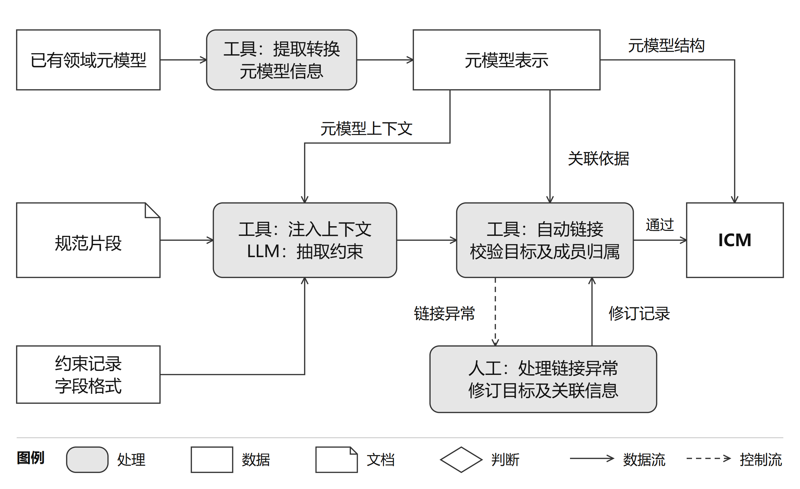
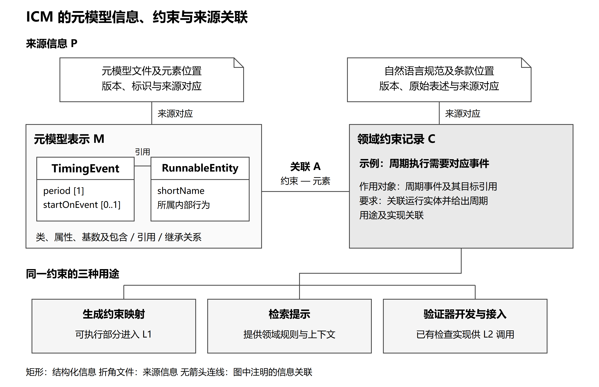
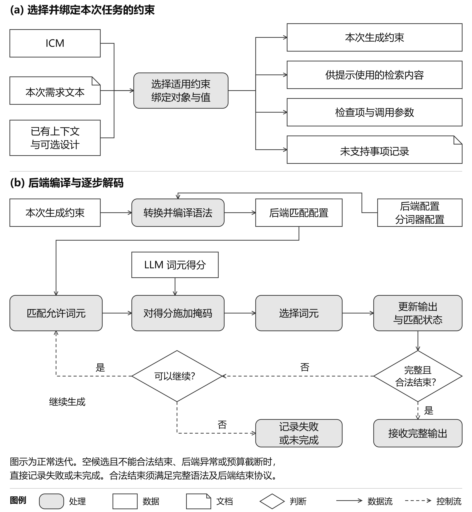
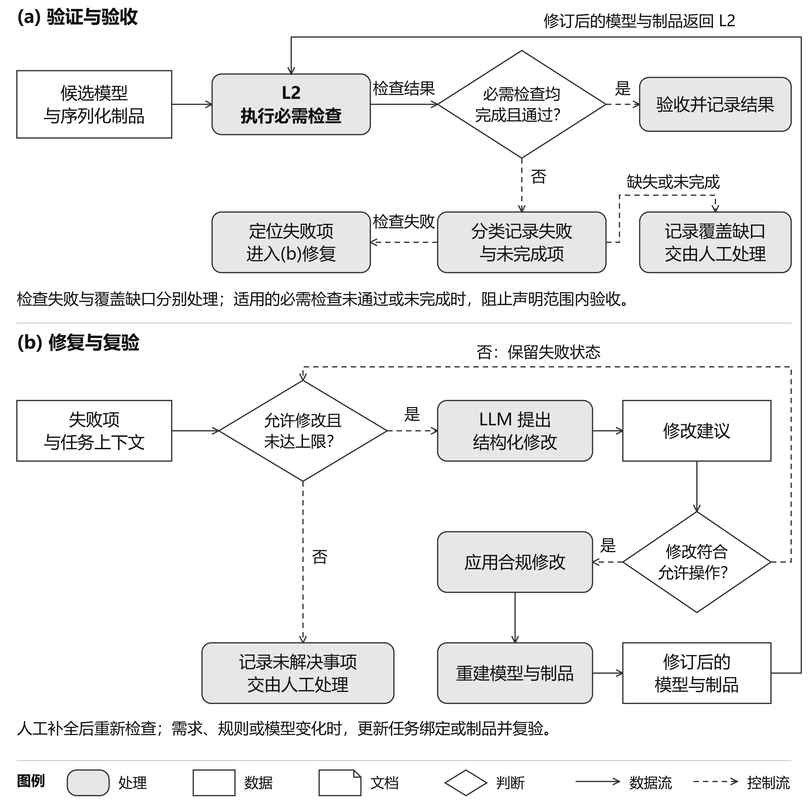
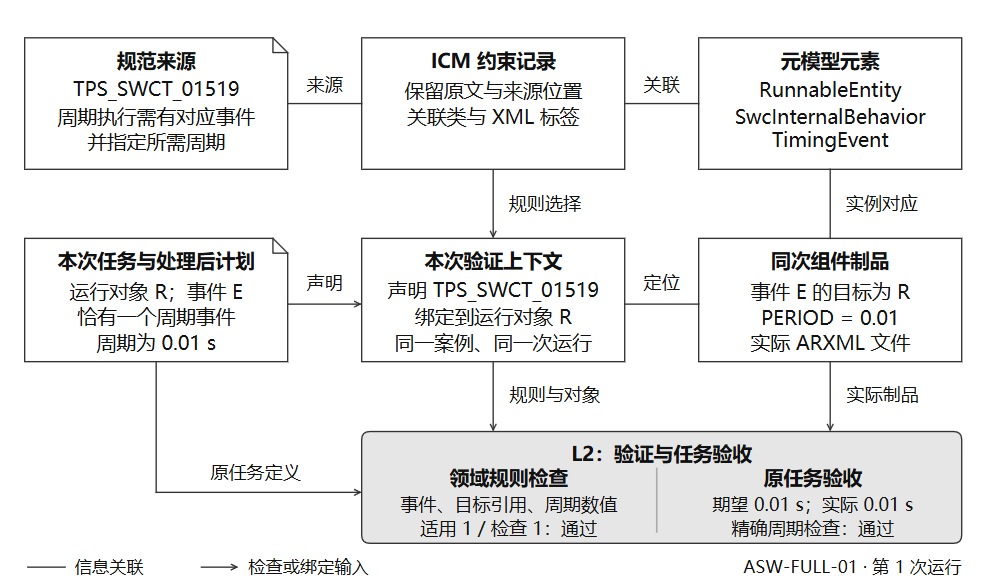
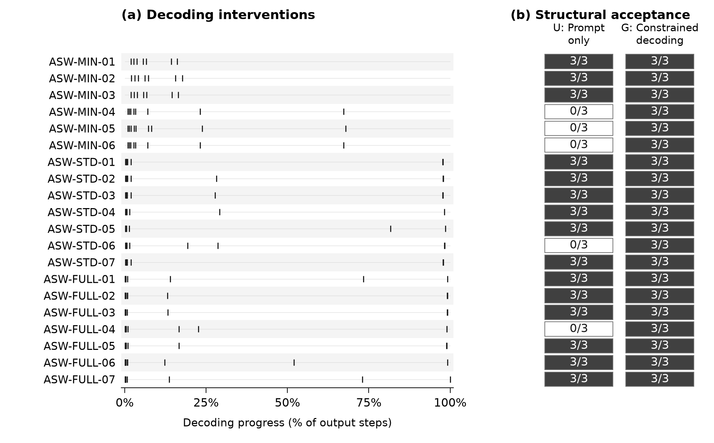
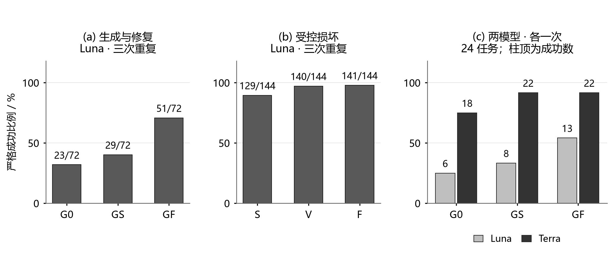

# 摘要

大语言模型为自然语言驱动的工程建模提供了新的交互方式，但生成结果仍可能违反模型结构、领域规则或具体任务要求。本文提出一种以领域元模型为基础、协同执行生成时约束与生成后验证的模型生成方法。方法首先提取并转换元模型信息，以元模型术语引导自然语言规范中的结构化约束抽取，自动将约束链接到元模型元素并记录规范出处，构建集成约束模型（Integrated Constraint Model，ICM）。任务执行时，结合需求和已有模型选择适用约束：生成时约束层 L1 限制候选结构、取值和引用，生成后验证层 L2 检查模型及其序列化制品，并核对原始任务要求；发现问题后，依据验证反馈在允许范围内修复并重新验收。验证能力来自已有领域工具和 LLM 辅助人工编写的检查器。实验覆盖 AUTOSAR、铁路模型和国际私法结构化决策，其中 AUTOSAR 的 20 个需求各运行 3 次，60 次完整流程均通过任务范围内的验收，形成的 255 份 ARXML 均通过 XSD 检查；独立的 AUTOSAR 本地实验记录了约束对解码过程的实际干预。结果表明，生成时限制与生成后检查能够协同支持模型构造，并依据领域规则和原始任务要求检测问题、指导修复与验收。

关键词：模型驱动工程；大语言模型；元模型；分层约束；集成约束模型。

# 1 引言

模型驱动工程（Model-Driven Engineering，MDE）将模型作为软件与系统开发中的主要制品，通过显式的建模语言、模型转换和分析工具支持设计、验证与实现。领域专用建模语言以领域概念表达问题，其元模型规定模型的抽象语法，包括元素类型、属性、继承、包含与引用关系，以及关系的基数等要求；良构约束进一步规定合法模型需要满足的条件。模型转换连接不同抽象层次和不同表示，并支持从模型生成代码及其他制品<sup style="color:#FF0000">[1]</sup>。这些机制为自动化提供了明确的操作对象和检查依据。

大语言模型（Large Language Model，LLM）使用户能够通过自然语言提出建模要求，并获得模型元素、关系和属性值的建议。近期研究已将 LLM 用于领域建模、模型实例生成、交互式补全和建模制品转换，推动自然语言交互与既有 MDE 工具结合<sup style="color:#FF0000">[2]</sup>。然而，语言上合理的回答与可被建模工具接受的模型之间仍有距离。生成器需要同时遵守类型、必需特征、嵌套结构、基数和引用关系，还要满足规范中的复杂语义与逻辑要求，以及当前任务指定的对象、取值和连接方式。模型越复杂，这些要求在生成过程中越容易相互影响。

结构正确本身就是这一问题的重要组成部分。以 AUTOSAR 为例，软件组件模型的 ARXML 表示具有多层嵌套、不同类型的引用和由 XML Schema 规定的元素排列要求。错误的包含位置、缺失的必需元素或不正确的引用类型，都可能使制品无法进入后续工具链。即使采用 JSON 作为生成时的中间表示，也需要保留其与领域模型的对应，并在序列化时落实目标格式的要求。例如，以对象属性表示模型特征时，属性书写顺序不能替代 XSD 中的元素顺序规则<sup style="color:#FF0000">[3]</sup>；后者需要由序列化映射和目标格式检查共同处理。

结构要求、领域规则和任务要求又各有侧重。例如，任务要求为已有运行实体 R 配置一个每 10 ms 触发一次的周期事件。运行实体（Runnable）表示可被触发执行的软件行为。在其 XML 表示中，缺少必需的事件名称元素违反结构要求；事件引用了不存在的运行实体，违反模型引用的一致性要求；周期写为 0.02 s，则即使结构和引用正确，也不满足本次指定的 10 ms。修复时直接删除该事件虽然可能消除某项违反，却使模型失去任务要求的周期触发行为。因此，模型构造需要共同处理**元模型符合性（metamodel conformance）**、所声明规则下的**模型一致性（model consistency）**和**需求满足（requirements satisfaction）**。

这些建模依据通常分布在不同来源中。元模型提供类型和关系等结构信息，自然语言规范补充跨元素条件、逻辑依赖、适用前提与例外，具体任务则确定本次需要构造和保留的内容。此外，生成还可能依赖**已有模型上下文（existing model context）**，即当前模型中可供引用或需要保持的对象及其属性和关系。例如，上述运行实体 R 及其所在内部行为、组件模型中已经定义的接口及其路径，都应参与本次构造。将这些信息全部放入提示，并不等于已经将它们落实为可执行的约束。

已有研究从不同环节将显式知识引入生成。Synchromesh 结合检索与受约束语义解码，在输出构造过程中执行语法、类型和部分上下文规则<sup style="color:#FF0000">[4]</sup>；AbsCon 将多个候选图聚合为概率部分模型，再根据元模型和良构约束求解一致模型<sup style="color:#FF0000">[5]</sup>；EMF-Kaizen 将元模型和当前模型用于交互式模型片段推荐<sup style="color:#FF0000">[6]</sup>。这些工作表明，约束既可以参与生成，也可以用于候选的检查与选择。对于同时涉及复杂结构和领域逻辑的任务，一个关键问题是如何组织两类互补能力：尽可能在生成时排除不合法的结构与取值，同时在模型形成后检查依赖完整对象、跨元素关系或目标制品的要求。

本文围绕这一问题提出一种**元模型引导的分层约束模型生成方法**，以生成时约束层 L1 与生成后验证层 L2 协同处理结构构造和领域规则满足。L1 将适合提前执行的要求落实到受约束解码，L2 调用领域检查工具审查生成模型及其序列化制品，任务验收再核对原始需求中指定的对象、取值与关系。两层按执行阶段和实际检查能力分工，结构与逻辑要求根据表示方式和后端能力分配到相应层次。

为支持这种分工，方法构建可复用的**集成约束模型（Integrated Constraint Model，ICM）**。首先从已有领域元模型提取并转换信息，保留元素标识及其源表示对应；再将元模型术语注入自然语言规范的约束抽取过程，识别约束的作用对象、条件、要求与例外，自动建立约束与元模型元素的链接，并记录规范出处。元模型元素为约束解释提供共同的领域语境，ICM 将分散的结构信息和规范要求组织为生成、检索与检查的共同依据。

单次任务执行时，方法根据需求和已有模型选择相关约束，并将其绑定到本次对象、取值和引用目标，动态组装生成限制与检查配置。这些任务相关的临时要求用于当前生成和修复，可复用的领域规则则保存在 ICM 中。发现错误后，检查反馈指出违反了什么要求、涉及哪些对象，修复过程据此提出允许范围内的修改。每次修复后重新检查领域规则与原始任务，避免通过删除必需对象或改写指定取值获得表面的通过。

本方法适用于能够用元模型描述的领域，前提是任务相关约束能够转化为生成时约束和生成后验证规则。领域元模型作为输入提供，生成映射和验证工具在领域准备阶段接入。本文采用已有领域工具，并由 LLM 辅助人工编写自定义检查器。

本文的贡献包括三个方面。

（1）**生成与验证协同的分层约束方法。**通过 L1 的生成限制和 L2 的生成后检查，共同处理结构构造与领域规则满足；将原始任务要求保留为生成和修复的验收依据，形成受约束的模型构造、检查与修复过程。

（2）**以元模型元素为锚点的 ICM 构建方法。**通过元模型信息转换、术语引导的结构化约束抽取和自动链接，将规范要求关联到其作用元素，保存来源和执行用途，为分层执行提供可复用的约束依据。

（3）**三个领域中的实证评价。**在 AUTOSAR 汽车软件模型、铁路模型以及国际私法（Private International Law，PIL）结构化决策中，分别考察模型与制品验收、约束对解码过程的干预、验证反馈修复和决策约束的执行效果。前两个领域评价工程模型实例构造，PIL 则考察分层原则在规则密集、对结论可靠性要求较高的决策任务中的应用。

AUTOSAR 的 20 个需求各运行 3 次，60 次完整流程均通过任务范围内的验收，形成的 255 份 ARXML 均通过 XSD 检查；85 个核心受控故障单元和 15 个替代单元均完成修复。另设 AUTOSAR 本地解码实验，直接观察约束在生成过程中的作用。铁路主实验包含 24 个任务，各运行 3 次，严格成功数由初始生成的 23/72 提高至验证反馈修复后的 51/72。PIL 实验包含 60 个案例，完整约束配置在结构、规则和任务结论的综合判定上取得改善。这些实验分别呈现分层方法的工程流程、执行机制和跨域应用效果；铁路中仍未修复的任务也用于分析当前生成与修复能力的边界。

本文其余部分安排如下：第 2 节讨论相关工作；第 3 节介绍分层约束方法及 ICM 构建；第 4 节依次报告 AUTOSAR 工程实验、AUTOSAR 本地解码实验、铁路实验和 PIL 实验；第 5 节总结研究并讨论后续方向。附录按这些实验分别提供需求来源、AUTOSAR 规范约束抽取规格、检查器构造和补充结果，并给出 AUTOSAR、铁路和 PIL 各一个从任务输入到最终验收的完整示例。

# 2 相关工作

相关研究包括以元模型和约束构造一致模型的传统 MDE 技术，以及自然语言驱动的建模、结构化约束获取、受约束解码和反馈修复。

## 2.1 模型转换与一致模型生成

MDE 通过建模语言规定可表达的概念和合法模型的条件。元模型刻画抽象语法，良构约束补充类型、关系等结构定义难以完整表达的要求，具体语法则规定模型的文本或图形呈现。OCL 可以在模型上下文中表达不变式、前置条件和后置条件，并为这些表达式规定类型及求值语义<sup style="color:#FF0000">[7]</sup>。XMI 提供模型对象的 XML 交换表示<sup style="color:#FF0000">[8]</sup>。这些基础说明，模型及其序列化文档具有相互关联但不同的检查对象：文档能否解析、对象是否符合元模型、跨对象规则是否满足，需要使用对应的依据判断。

模型转换将不同模型或表示之间的对应关系显式化。Kahani 等对模型转换工具进行分类，讨论模型到模型、模型到文本转换及其支持能力<sup style="color:#FF0000">[1]</sup>。Ma 等的双阶段代码生成框架融合 XMI 结构信息与 XSD 约束，先生成静态代码结构，再依据模型注解和关联补充行为<sup style="color:#FF0000">[9]</sup>。这类工作体现了工业建模语言接入中表示转换的重要性：类型和结构需要在不同表示间传递，目标制品还可能具有源表示中未直接呈现的组织要求。读取元模型并形成便于处理的表示，与据此创建模型实例、生成代码或交换制品，是可以衔接的不同操作。

一致模型生成使约束直接参与模型构造。Semeráth 等以元模型、良构约束和搜索规模为输入，通过三值部分模型细化、约束传播和增量检查引导图求解，并在具体化后检查原始良构约束<sup style="color:#FF0000">[10]</sup>。该方法能够从最抽象部分模型或工程师提供的初始部分模型开始，在搜索过程中利用显式约束缩小候选空间。这为生成时控制与完成后检查的协同提供了 MDE 基础。相对于以形式化约束驱动求解，自然语言驱动的生成还需要确定文本中的概念和要求如何对应到可操作的模型元素，以及本次任务应选用哪些约束。

## 2.2 大模型辅助建模与模型实例构造

LLM 辅助建模的研究对象涵盖建模语言及其元模型、符合已有语言的模型实例，以及对当前模型的补全和修改。Di Rocco 等从 MDE 活动出发梳理这一研究领域，讨论建模制品的编码、生成结果后处理和评价，并提出 LLM 与 MDE 相互支持的研究议程<sup style="color:#FF0000">[2]</sup>。这一视角强调将生成能力接入模型工具链，而不把建模任务简化为普通文本输出。

自然语言与语言定义相结合是常见的生成方式。Alaoui Mdaghri 等利用自然语言说明和建模语言文档生成 DSL 模型，并通过迭代过程验证结果<sup style="color:#FF0000">[11]</sup>。Petrovic 等的汽车系统技术报告将 Ecore 元模型与需求组合为提示，生成 XMI 实例，以 OCL 检查决定是否进入下游代码生成；报告同时探索了根据参考要求和元模型提出 OCL 约束<sup style="color:#FF0000">[12]</sup>。这些研究连接了自然语言输入、显式语言表示和后续模型处理。

领域配置生成进一步揭示了中间表示和制品映射的作用。El-Gnainy 等研究 AI 辅助 AUTOSAR 配置、数据集生成与代码生产<sup style="color:#FF0000">[13]</sup>。Samy 等采用微调模型生成精简 JSON，再确定性展开为 ARXML，并在 Watchdog Manager 配置中评价结构、引用、参数和语义条件<sup style="color:#FF0000">[14]</sup>。精简表示降低了生成器直接处理复杂交换格式的负担，但相应的展开规则仍是领域实现的重要组成部分；中间表示的合法性与最终 ARXML 的合法性需要通过这一映射连接。

面向建模环境的交互式助手则以当前模型作为持续演化的上下文。EMF-Kaizen 在抽象语法层面结合元模型、当前模型、用户请求和示例推荐模型片段，并支持元模型裁剪、JSON 与 EMF 对象转换以及由用户选择片段纳入模型<sup style="color:#FF0000">[6]</sup>。其适用对象包含领域模型和元模型，体现了基于共同建模基础设施复用助手能力的方向。该文报告的实现采用容错解析处理返回片段，元模型中的 OCL 注解可以进入提示，但尚未对推荐片段执行 OCL 检查<sup style="color:#FF0000">[6]</sup>。交互式推荐关注可供建模者继续使用的片段，完整任务生成则还需要判断必需对象及关联是否齐备。

AbsCon 将候选之间的一致性与显式约束结合：先从同一文本生成多个候选图，合并为概率部分模型，再通过约束优化选择满足元模型和良构约束的具体模型<sup style="color:#FF0000">[5]</sup>。这里的约束参与最终模型的求解，而不仅用于事后评分；该文实现中，元模型及良构约束由人工转为一阶逻辑表达<sup style="color:#FF0000">[5]</sup>。与直接生成、交互补全等方式相比，这一路线利用多候选中的共同信息减少不一致，展现了模型求解与语言模型生成互补的可能性。

## 2.3 结构化约束获取与可追溯性

将自然语言规范用于自动化，需要确定规则所指的领域概念、适用范围和逻辑关系。模型上下文可以为这种解释提供类型和导航依据。PathOCL 以 UML 类模型和自然语言约束为输入，选取相关类及模型路径构造提示，再生成 OCL 表达式。该文分别评价约束的可编译性和语义正确性：路径提示缩短了单次输入，通过多条路径尝试提高了可编译约束的比例，语义正确率的改善较小<sup style="color:#FF0000">[15]</sup>。这反映了约束获取中的两个关联问题：为文本找到合适的模型上下文，以及将文本要求正确表达为约束。

可追溯性关注不同制品间的对应关系及其使用。Winkler 和 von Pilgrim 讨论了需求工程与模型驱动开发中的制品追溯，以及两类活动之间的衔接<sup style="color:#FF0000">[16]</sup>。对于约束生成，来源与模型元素的链接能够帮助解释一条规则依据哪段规范、作用于哪些类型或关系，并支持后续修改时定位受影响的内容。规则关联到元模型元素，有利于跨任务复用；规则在某次任务中绑定到具体对象，则确定了该次检查的作用范围。

检索增强生成将外部文档的检索结果与语言模型的文本生成过程结合<sup style="color:#FF0000">[17]</sup>。在工程规范场景中，检索可以补充适用条件、例外及背景解释；结构化约束则进一步显式记录这些信息与模型元素的联系。两者可以结合使用：同一项要求既可作为提示中的依据，也可在存在相应映射时用于生成控制或逻辑检查。元模型信息的组织、文本要求的结构化和可执行检查的实现由此形成相关但不同的工作，完成文本抽取并不意味着已经生成了检查程序。

## 2.4 受约束解码与验证反馈修复

受约束解码在生成过程中筛选合法的后续词元，使已编码的结构要求直接影响输出。Geng 等研究面向结构化任务的语法约束解码及依赖输入的文法<sup style="color:#FF0000">[18]</sup>。XGrammar 通过文法处理与运行时掩码计算优化结构化生成效率<sup style="color:#FF0000">[19]</sup>；XGrammar-2 进一步支持单次请求中的动态结构切换和跨文法缓存复用<sup style="color:#FF0000">[20]</sup>。这些技术使随任务变化的结构限制能够在解码时执行，为将元模型中的类型、必需特征、枚举和可表示的关系限制接入模型实例生成提供了基础。

生成时控制也可以包含语义信息。Synchromesh 将示例检索与补全引擎结合，在部分输出上执行语法、作用域、类型和部分上下文逻辑<sup style="color:#FF0000">[4]</sup>。Projectional Decoding 提出在生成文本的同时维护部分图模型，以元模型和增量语义检查筛选后续词元，并在程序生成任务上进行了初步评价<sup style="color:#FF0000">[21]</sup>。因此，生成阶段与生成后阶段的区别并非语法和语义的绝对分界。适合提前检查的条件取决于部分模型中已经确定的信息、约束的可执行表示和后端能力；需要完整模型或跨制品上下文的条件仍可由后续检查承担。

约束执行还会影响生成分布。Grammar-Aligned Decoding 指出，逐步屏蔽非法词元并重新归一化，通常不等同于在完整序列满足文法的条件下从原模型分布采样，并提出具有渐近收敛性质的采样方法<sup style="color:#FF0000">[22]</sup>。这一结果区分了输出合法性与采样分布保持两个目标。对工程建模而言，受约束解码可减少不合法候选，但候选是否满足任务含义仍需要相应的评价依据。

模型一致性维护为修复提供了定位和操作选择机制。Marchezan 等依据规则求值过程定位不一致原因，构造包含替代项与操作序列的抽象修复树，并支持按制品或用户所有权筛选动作<sup style="color:#FF0000">[23]</sup>。LLM 反馈修订研究则探索如何利用反馈生成新候选。Self-Refine 由同一模型生成结果、提出反馈并迭代修订<sup style="color:#FF0000">[24]</sup>；SpecGen 面向 Java 程序生成 JML 规格，先利用验证错误反馈改进候选，再结合运算符变异与启发式筛选寻找可验证规格<sup style="color:#FF0000">[25]</sup>。这些研究表明，反馈来源、可用修改操作及候选接纳条件共同影响修复效果。

已有研究为模型转换、约束求解、受约束解码与反馈修复提供了多种实现能力。本文以 L1 与 L2 的分层执行组织这些能力：在生成时限制可执行的结构与取值要求，在生成后检查完整模型及其制品，并依据原始任务接纳修复结果。ICM 构建将元模型信息、结构化规范约束及其来源关联起来，再根据任务确定作用对象，为两层提供共同依据。后续实验分别评价工程模型与制品、解码干预和跨域约束执行。

# 3 元模型引导的分层约束生成方法

本方法以**集成约束模型**（Integrated Constraint Model, ICM）组织元模型信息和领域规则，将任务相关要求分别落实为**生成时约束执行**（L1）与**生成后验证**（L2）。L1 在候选内容产生时限制其结构和取值，L2 在构造后的模型及目标制品上检查结构符合性、领域一致性和任务要求，并向修复提供诊断。两层通过共同的约束依据与任务绑定衔接，构成从需求到模型生成、验证和修复的完整过程。

## 3.1 适用范围与方法概述

本方法适用于能够用**领域元模型**（domain metamodel）描述的领域，前提是任务相关约束能够转化为生成时约束和生成后验证规则。领域元模型作为输入提供，其他输入包括自然语言领域规范、本次任务需求，以及**已有模型上下文**（existing model context）。这里的模型上下文指生成前已经存在、可能被本次任务使用的模型元素及其属性和关系。例如，为系统增添周期事件时，已有运行实体的名称、类型及引用路径就是新事件需要使用的模型上下文。

元模型规定可使用的类型、属性、继承、包含与引用关系、基数及枚举等结构信息；自然语言规范补充适用条件、例外、跨元素一致性及复杂的语义和逻辑要求。具体任务进一步指定要构造的对象、对象数量、取值、连接方式和目标输出。即使只考虑结构，深层嵌套、可选分支、重复元素和引用也会相互影响。因此，结构正确性从生成阶段开始处理，并在模型构造和序列化后继续检查。

JSON Schema 通过验证关键字描述 JSON 实例的字段类型、必需项、数量及允许值，为结构化生成提供约束表示<sup style="color:#FF0000">[26]</sup>。本方法按任务组装这些限制，再由受约束解码后端将其用于生成过程。例如，XGrammar 可编译相应约束并据此筛选允许生成的词元<sup style="color:#FF0000">[19]</sup>。JSON Schema 是本方法采用的一种实现形式；领域适配也可以使用后端支持的文法等其他约束表示。

**候选模型**（candidate model）是依据领域元模型构造、尚待验证和验收的实例模型，包含具体对象、属性值及对象之间的关系。JSON Schema 规定本次允许生成的结构和取值，生成的具体内容经模型构造后形成候选模型。**序列化制品**（serialized artifact）是候选模型在目标建模语言或交换格式中的具体表示，例如 XML 文件。对于结构化决策应用，输出可以是包含事实、适用规则和结论的决策记录；这类输出复用分层约束执行过程，其表示与领域概念的对应在领域适配中确定，与工程实例模型的构造分别说明。

整体流程分为领域准备和任务执行。领域准备从已有元模型提取信息，以元模型术语引导自然语言约束抽取，自动建立约束与元模型元素的链接并保存规范来源，形成可复用的 ICM；同时提供生成约束映射、模型构造与序列化规则，以及可调用的验证器。任务执行将本次需求绑定到具体对象与取值，组装 L1 生成约束，检索相关规则，并配置 L2 检查。生成结果经模型构造和序列化后进入验证与任务验收；发现可处理的问题时，依据诊断修改模型并复验。图 1 展示这一过程。


图 1 领域准备与单次任务执行。ICM、生成映射和验证器在领域准备阶段形成，供不同任务复用；任务绑定确定本次生成、检索和检查的内容。L1 限制生成过程，L2 检查构造后的结果并驱动修复，任务验收依据原始需求确定。

以一个简化的 ARXML 片段说明三类要求。任务是“为已有运行实体 R 配置一个每 10 ms 触发一次的周期事件”。**运行实体**（Runnable）表示可被触发执行的软件行为；模型上下文已提供 R 的路径 /Component/Behavior/R。下列片段省略外层组件和行为结构，使用简化路径，周期值以秒为单位：

```xml
<TIMING-EVENT>
  <SHORT-NAME>TE_R</SHORT-NAME>
  <START-ON-EVENT-REF DEST="RUNNABLE-ENTITY">/Component/Behavior/R</START-ON-EVENT-REF>
  <PERIOD>0.01</PERIOD>
</TIMING-EVENT>
```

缺少必需的事件名称属于结构问题；引用指向不存在的运行实体属于模型关系问题；周期写为 0.02 s，则即使结构与引用均正确，也没有满足本次 10 ms 的要求。这些要求并不机械对应不同阶段：已经确定的目标引用和周期可以提前限制生成，生成后仍需检查构造与序列化得到的结果。

领域适配者负责提供生成映射和验证器。本文的自定义检查器采用 LLM 辅助人工编写，原生格式检查使用现有工具。

## 3.2 提取与转换元模型信息

ICM 构建首先将已有元模型转换为可查询的中间表示。转换读取元模型元素的标识、属性类型、继承关系、包含与引用关系、基数及枚举等信息，保留源元素标识和版本。对于具有独立交换语法的领域，还需保留元模型元素与目标语言构造之间的映射，例如模型属性对应哪个 XML 属性或元素、包含关系对应哪些包装节点。

转换结果可以采用对象模型、关系记录、JSON 或图结构。其关键是保存后续抽取、查询与绑定所需的信息及源元素对应，而不是选择某一种存储格式。模型驱动语言工程区分抽象语法、具体语法及其演化关系<sup style="color:#FF0000">[27]</sup>。相应地，元模型表示描述领域构造，序列化映射规定其目标表达，生成约束规定本次允许生成的结构和值。三者在流程中承担不同职责。

转换后的类型、属性和关系为文本抽取提供规范术语，也为任务对象的类型选择、关系构造与约束定位提供依据。约束关联的是元模型中的类型或关系定义；本次任务指定的对象，则是这些类型的具体实例。

## 3.3 元模型引导的约束抽取与 ICM 构建

ICM 将元模型提供的结构信息与自然语言规范中的规则组织在一起。自然语言规范以片段为单位进入抽取流程。系统将相关元模型类型、属性、关系和枚举术语加入抽取上下文，要求 LLM 按统一记录格式提取作用对象、适用条件、要求与例外，并保留规范版本和片段位置。元模型术语为文本解释提供共同的概念依据，使抽取结果能够直接关联领域元素。

系统随后自动将抽取记录链接到元模型元素：解析目标名称，校验目标类型以及属性、关系或枚举字面量的归属，建立约束到相应元素的引用。链接失败、名称歧义或成员不匹配的记录进入人工处理；处理者对照规范及元模型补充或修正记录，再执行链接检查。已有的结构化规则和领域检查定义也可以按相同信息要求接入 ICM，复用其规则内容与来源。图 2 给出从自然语言规范构建 ICM 的流程，表 1 列出约束记录的主要信息。



图 2 从已有领域元模型及自然语言规范构建 ICM。元模型表示提供抽取术语、自动链接依据及结构信息；链接异常交由人工处理，ICM 保存约束内容、元素关联、来源和后续用途。

表 1 ICM 约束记录的主要信息

| 信息 | 内容 | 后续作用 |
| --- | --- | --- |
| 标识与来源 | 规则标识、规范版本、片段位置及原始表述 | 回查约束依据及区分版本 |
| 约束内容 | 作用范围、适用条件、要求及例外 | 确定何时、对哪些对象检查什么 |
| 元模型元素关联 | 涉及的类、属性、包含或引用关系 | 按领域概念检索并绑定任务对象 |
| 用途与实现关联 | 用途、生成映射或检查器标识 | 连接生成、检索与验证环节 |
| 链接检查 | 目标名称、类型和成员归属的检查结果及异常项 | 定位未匹配或冲突的关联并支持修正 |

为概括其中的信息关系，本文将 ICM 表示为：

$$I = (M, C, A, P)$$

其中，$I$ 表示接入领域的集成约束模型；$M$ 是提取和转换后的元模型表示，包括元素标识、类型、属性、关系、基数和枚举等信息；$C$ 是持久保存的领域约束记录集合，包括从规范抽取的约束，以及需要独立引用的元模型结构规则；$A$ 是约束记录与元模型元素之间建立的关联；$P$ 是来源信息及其与元模型元素、约束记录的对应，包括源元模型或模式文件、自然语言规范的版本和具体位置。约束的用途、已有实现关联及链接检查结果保存在约束记录中。

图 3 展示这四类信息。约束和元模型元素之间可以存在多对多关联：一条引用一致性规则可以同时涉及引用方类型、引用关系和目标类型，同一类型也可以参与多条规则。来源记录则使读者能够从该约束回到规范原文，并从相关类型和属性回到元模型定义。



图 3 ICM 的信息与关联。元模型表示 M 提供领域元素及关系，约束记录 C 表达规则内容，关联 A 连接约束与其作用元素，来源信息 P 支持回查。下方三类用途共用这些信息，不构成额外的元模型层次。

ICM 中的结构化约束有表 2 所列的三种用途。同一条约束可以参与多种用途。能够映射为结构和值限制的部分进入生成约束；完整规则及其解释可用于检索提示；需要在完整模型上判断的内容则为验证器开发提供依据。用途与已有实现分别记录，因而 ICM 既组织可执行约束，也保存检索与验证器开发所需的信息。

表 2 ICM 约束的三类用途

| 用途 | 使用方式 | 示例 |
| --- | --- | --- |
| 生成时结构约束 | 通过已有映射限制类型、必需项、数量、枚举或引用候选 | 将引用限制为上下文中类型匹配的目标 |
| 检索提示 | 按任务涉及的元素和条件检索规则及其上下文 | 提供引用关系的适用条件与规范解释 |
| 验证器开发依据 | 人工依据规则与元模型实现或接入检查，LLM 辅助开发 | 检查最终引用的目标是否存在且类型正确 |

这种组织保留了结构信息、文本规则和执行依据之间的联系。它使一项要求可以在生成时提前限制候选内容，在生成后检查最终关系，并在失败时回溯到对应规则和模型元素，而无需为每次任务重新解释整份领域规范。

## 3.4 绑定本次任务的对象与要求

持久 ICM 描述跨任务复用的领域信息，本次需求规定具体对象、数量、取值与连接关系。系统结合已有模型上下文识别相关元模型元素，选择适用约束，再将要求绑定到本次任务中的具体对象。由自然语言需求提取的临时约束仅对当前任务及其修复生效，不自动写回持久 ICM。

根据领域复杂度，任务执行可以采用多阶段信息输入与生成：先分析需求并确定组成对象及依赖，再输入与各部分相关的元模型信息、规范片段和可用引用，逐步生成模型。先前阶段形成的设计为后续约束组装提供结构选择；已生成且可使用的对象则更新模型上下文。需求中明确给出的对象身份和取值保持为任务依据，LLM 提出的设计需与这些要求对应。

绑定结果用于三个环节。具有生成映射的要求进入 L1 生成约束；检索得到的规范内容作为外部知识加入提示<sup style="color:#FF0000">[17]</sup>；需要在构造结果上判断的要求，则绑定到已有检查器的输入对象和参数。运行时可据此装配新的检查项，而无需为每个任务生成新的验证代码。

在前述周期事件示例中，运行实体 R 和 10 ms 周期来自本次需求，绑定时分别确定目标引用与周期值；引用必须指向适当类型的对象，则属于可复用规则。任务验收据原始需求检查目标和周期，另一个类型正确的运行实体仍不能代替指定的 R。

## 3.5 组装生成约束与受约束解码

### 3.5.1 动态组装生成约束

L1 将元模型结构、适用领域规则及任务绑定中可执行的部分组装为本次生成约束。JSON Schema 可表达字段类型、必需项、数量、固定值及枚举等限制<sup style="color:#FF0000">[26]</sup>。动态组装以元模型为结构依据，以任务选择确定需要展开的部分，并结合已有模型上下文约束可用引用。因此，生成规范随任务及已获得的上下文变化。

算法 1 概括采用 JSON Schema 时的组装过程。领域适配阶段提供类型和关系的查询能力、约束映射、目标结构模板及序列化映射；运行时据此递归展开任务所需结构。模型对象已经确定的身份、数量和赋值，可以编码为固定限制，也可以由确定性程序装配；需要 LLM 决定的内容保留其合法取值范围。

**算法 1 按任务组装 JSON Schema**

输入：ICM、本次任务绑定、已有模型上下文、领域结构与序列化映射，以及后端支持的约束范围。

输出：供本次调用使用的生成 schema，以及生成后模型装配所需的对应信息。

1. 根据任务绑定，从元模型表示中确定所需类型、对象及其依赖。
2. 展开必需结构与任务选定的分支，将类型、必需性和基数映射为字段限制。
3. 结合任务要求与已有模型上下文，绑定固定值、枚举范围和可用引用候选。
4. 合并已有映射支持的领域约束，保留与 ICM 规则和任务要求的对应。
5. 检查组装结果，适配解码后端，输出生成 schema 及模型装配所需的对应信息。

引用候选由目标类型、作用域和模型上下文共同确定。任务已指定目标时，按该对象绑定；仍需选择时，保留符合条件的候选集合。对同次任务中尚待构造的目标，装配后再核对其存在性、类型及关系一致性。确定性内容由装配规则处理，需在完整结果上判断的要求配置给 L2。

生成约束的表达与目标语言的表达并不总是一一对应。以 XML 目标为例，XML Schema 可以要求子元素按 sequence 出现<sup style="color:#FF0000">[3]</sup>。采用 JSON 对象承载命名字段时，字段的排列没有直接携带这一 XML 顺序要求；本方法的相应适配由序列化器依据目标模式排列元素，再用 XML Schema 验证制品。这体现了生成约束、模型构造和目标表达之间的职责分配。采用其他中间表示或直接针对目标语言解码时，可以选择不同的映射方式。

### 3.5.2 受约束解码如何参与实例模型生成

在 MDE 中，生成输出需要能够被解析、构造为实例模型并交由后续工具处理。错误的层次结构、遗漏的必需项或非法枚举会使这一过程在进入领域验证前就失败。**受约束解码**（constrained decoding）将已编码的结构限制作用于生成的每一步，使模型在允许的表达空间内选择内容，为后续模型构造提供满足生成规范的输入<sup style="color:#FF0000">[18]</sup>。

可控制的解码后端先将本次生成规范转换为支持的语法表示，并结合分词器进行编译<sup style="color:#FF0000">[19]</sup><sup style="color:#FF0000">[20]</sup>。生成过程中，匹配器根据当前输出前缀维护语法状态，确定下一步允许的词元。LLM 给出下一词元的得分后，后端将不允许词元的得分设为负无穷，再从允许候选中选择下一个词元；输出增加该词元，匹配器也随之更新，直至完成输出。

这一控制既涉及标点和嵌套结构，也涉及 schema 已编码的字段名与合法值。进入引用取值时，约束可将输出限制在本次配置的候选路径内；进入已绑定的数值字段时，则可限制为任务指定的值。词元与字符、语法符号并非一一对应，后端需在分词器层面维护这些允许关系<sup style="color:#FF0000">[19]</sup>。图 4 将任务约束组装与这一逐步执行过程分开表示。

检索提示与受约束解码在此承担互补作用：前者提供需求含义和领域依据，后者排除违反已执行结构限制的延续。受约束解码会改变原模型的输出分布；逐步筛选并重新归一化，通常不同于在完整输出满足约束的条件下从原模型分布采样<sup style="color:#FF0000">[22]</sup>。因此，L1 的作用是执行已经编码且得到后端支持的生成约束，领域一致性与任务满足情况继续由 L2 检查。

### 3.5.3 从生成结果到模型与序列化制品

完整输出返回后，系统首先按本次提交的 schema 执行 JSON Schema 验证，检查字段、类型、必需项、数量及已编码取值。随后依据保存的装配对应补入确定性内容、创建模型对象、组织包含关系并落实引用。若生成接口使用了经过投影的中间结构，装配后还需按原始生成约束检查恢复结果。这里的验证使接口返回、模型装配与任务约束保持衔接。

领域适配器再将候选模型转换为目标制品。序列化处理目标语言要求的包装层次、命名空间、引用表达及元素顺序，L2 则在模型和制品上检查相应结果。对于直接生成目标语言的适配，可以由领域解析器完成模型载入。无论采用哪一种路径，完整生成、模型构造与领域验证都对应明确的步骤；未完成输出不能进入成功验收。

托管结构化输出接口通过提交 schema 并验证返回值接入本流程；可控制的本地后端还可观察逐步解码中的约束干预。两者使用相同的生成约束与结果检查关系，解码过程的观测方式则在相应实验中说明。



图 4 任务绑定与 L1 执行。（a）结合任务需求、ICM 和已有模型上下文组装生成约束、检索内容及检查配置；（b）展示语法编译、允许词元筛选和状态更新。完整输出经结构验证与模型装配后进入 L2。

## 3.6 生成后验证与任务验收

L2 检查候选模型与序列化制品是否满足元模型规定、适用领域规则和本次任务。它与 L1 按表达能力和上下文需求分工：能够提前表达为结构或有限取值限制的要求在生成时执行；需要完整对象、跨对象关系或目标制品的要求在构造后判断。同一规则也可以同时参与两层。例如，L1 按目标类型筛选引用候选，L2 检查构造后的引用能否正确解析。近期研究也探索在模型构造期间执行部分语义检查<sup style="color:#FF0000">[21]</sup>，因而两层并不对应固定的“语法／语义”二分。

**验证器的构造与接入。** 领域准备阶段，适配者根据 ICM 约束及其来源确定检查的输入对象、适用条件、判定关系和诊断位置。已有工具能够判断的性质通过接口调用，例如目标格式验证；已有检查操作能够表达的性质通过规则模板和参数配置实现；跨对象的一致性要求则由专用检查器处理。本文自定义检查器的开发采用 LLM 辅助人工编写：LLM 协助整理规则、形成代码和测试候选，人工依据规范确认规则解释、选择实现并审查判定行为。

检查器采用满足规则、违反规则及相关边界情况的样例进行测试，然后登记其规则标识、适用范围、输入与参数、判定结果和诊断信息。任务执行从登记的检查能力中选择所需项，并绑定本次对象和上下文。由自然语言任务产生的临时约束，也通过已有检查操作与参数进入本次检查配置；需要新的判定逻辑时，由领域适配者补充检查能力。

**检查对象与验收依据。** 验证按实际作用对象组织为四个方面：生成表示与目标制品的格式有效性、候选模型的**元模型符合性**（metamodel conformance）、领域**良构约束**（well-formedness constraints）与其他规则，以及本次任务的**需求满足**（requirements satisfaction）。元模型符合性涉及类型、属性、关系和基数等规定，良构约束可以涉及跨元素一致性；某些格式工具也能同时检查内容结构<sup style="color:#FF0000">[3]</sup>。检查配置明确各项要求由哪个工具或检查器判断。

任务验收以原始需求或据其确定的结构化任务规格为依据。仅核对制品是否符合 LLM 的设计，无法发现设计对需求的遗漏。例如，若设计将 10 ms 误写为 20 ms，生成结果可能完全符合该设计；验收仍应根据原始周期要求发现偏差。同样，删除必须存在的周期事件可能消除一项引用错误，却没有实现任务要求的周期触发。

生成前确定本次任务的必需检查及适用条件。适用检查均完成且通过时，任务在相应范围内验收；规则违反进入失败诊断，无法完成的必需判断保留未完成状态。验证报告保存规则、对象位置和判定结果，使修复能够针对具体问题，并使最终结论对应实际执行的检查。

## 3.7 依据验证反馈修复模型

模型修复以不一致定位、编辑操作和修复候选为基础<sup style="color:#FF0000">[23]</sup>。本方法使用 L2 的规则标识、模型元素与制品位置确定可修改对象，再将失败诊断、相关规则、原任务要求及允许操作提供给 LLM。允许操作由领域适配者定义，例如修改属性值、替换引用、补充必需对象或删除允许删除的元素。

LLM 提出结构化修改后，确定性程序检查其操作与目标是否在允许范围内，将修改应用到模型或任务执行状态，重新构造制品并执行相关验证。复验同时检查领域规则、原始任务和受保护内容。只有符合编辑范围与接纳条件的修改才进入后续状态，修复成功以重新通过任务验收为准。

修复循环设置尝试上限，并保存修改内容与复验结果。通过验收后结束；达到上限仍未通过、或问题超出已有编辑能力时，保留当前模型与诊断供人工处理。若人工改变原始需求或领域规则，应更新任务绑定、生成约束和检查配置，再执行相应构造与验证。图 5 展示验证、修复和复验的关系。



图 5 L2 驱动的修复与复验。失败诊断用于定位修改对象，允许操作限制修复范围；修改后重建并复验，原任务要求贯穿接纳过程。自动处理结束后仍未解决的问题交由人工处理。

## 3.8 领域适配与可追溯性

本方法以表 3 所列接口连接通用流程与领域实现。ICM 提供统一的约束组织方式，适配组件提供元模型查询、生成映射、模型构造、验证和编辑能力。对于已有领域工具能够直接完成的操作，适配器调用其接口；其他操作依据目标元模型和制品表示实现。

表 3 领域适配接口

| 接口 | 输入 | 输出与责任 |
| --- | --- | --- |
| 元模型转换与查询 | 已有元模型及语言映射 | 可查询表示、源元素对应及元素标识 |
| 约束选择与组装 | ICM、任务需求、模型上下文及阶段设计 | 生成约束、检索内容、检查项与参数 |
| 模型构造与序列化 | 生成结果与装配信息 | 模型对象、包含与引用关系及目标制品 |
| 验证调用 | 模型与制品、检查配置及上下文 | 关联规则和对象位置的判定与诊断 |
| 定位与修改 | 失败项及允许操作 | 经检查的模型修改及复验输入 |

可追溯记录连接任务需求、ICM 规则与来源、实际生成约束、模型与制品、验证诊断及修改结果。领域规则通过元模型元素关联到本次对象，任务要求则通过绑定记录关联到具体取值和关系。这样既能回查某一限制的来源，也能说明它在哪一阶段执行、作用于哪个对象，以及修复后是否得到满足。临时任务约束随运行保存，其适用范围仍限于本次任务。

这一适配结构使元模型引导的约束组织、L1 执行和 L2 验证共同构成可复用的方法。领域之间变化的是模型表示、规则内容和具体执行能力；共同保留的是在生成时限制允许内容、在生成后检查完整结果，并依据原始任务接纳修复的分层原则。

# 4 实验评价

本章评价分层约束方法在模型生成和修复中的作用。AUTOSAR 实验基于已准备的 ICM，考察实例模型生成、ARXML 制品验收和受控故障修复；AUTOSAR-vLLM 实验直接观察生成约束对词元选择的干预；铁路实验考察具有跨对象关系的模型能否通过验证反馈得到修复；国际私法实验考察分层检查在结构化法律决策中的作用。附录 A—D 按相同顺序补充设置、详细结果和案例，并说明主要比较的统计方法；完整配对数据、敏感性分析及计算脚本保存在复现材料中。

## 4.1 研究问题与评价设置

评价围绕三个研究问题展开。

- **RQ1：如何将规范与元模型中的约束落实到一次模型生成任务？** AUTOSAR 实例展示 ICM 中的来源记录、元模型元素关联、任务绑定及其执行，并检查生成制品。
- **RQ2：生成时约束是否实际改变解码过程？** AUTOSAR-vLLM 在相同提示下比较提示约束与受约束解码，记录约束排除候选词元的位置及相应结构结果。
- **RQ3：生成后验证与修复能否纠正模型或决策中的错误，并保持原任务要求？** AUTOSAR 实验考察工程故障的检出与恢复；铁路实验比较同一初始模型上的修复策略，并补充第二模型；国际私法实验考察审计、修订与发布控制对决策结果的影响。

表 4 实验设计及规模

| 实验 | 基础任务与运行规模 | 主要评价对象 |
| --- | --- | --- |
| AUTOSAR 工程生成 | 20 个需求各运行 3 次；另有 85 个核心和 15 个替代故障单元 | ICM 应用、ARXML 结构与任务满足、受控修复 |
| AUTOSAR-vLLM 解码对照 | 相同 20 个案例各运行 3 次，三种条件，共 180 次生成 | 逐词元干预、结构验收、审计开销 |
| 铁路模型生成与修复 | 24 个基础任务各运行 3 次；第二模型各运行 1 次 | XMI 模型、领域关系和原任务要求 |
| 国际私法决策 | 60 个情景各运行 3 次，四种条件，共 720 个结果 | 结构化决策的检查、修订与参考判断兼容性 |

AUTOSAR 和铁路的主要指标是**严格成功**：最终制品通过适用的结构检查、领域检查和原任务验收。例如，一个铁路任务运行三次即得到三个生成起点；每个起点的自修复与验证反馈修复从同一初始模型出发。通过数以这 72 个起点为分母，未形成模型或修复后仍未通过的起点均计为失败。基础任务数仍为 24，用于表示需求与布局的多样性。各实验的条件在对应小节首次使用时定义。

托管主实验统一使用 gpt-5.6-luna，推理强度为 low；铁路第二模型使用 gpt-5.6-terra，推理强度同为 low。AUTOSAR-vLLM 使用本地 Qwen3.5-9B，以取得解码过程记录。自定义验证器由 LLM 辅助人工编写，作者负责解释规则、确定输入与适用对象、选择检查实现并进行测试；已有 XSD、EMF 和 VIATRA 验证能力直接复用。各领域的检查构造与配置在相应小节说明。AUTOSAR 和 PIL 生成任务的自然语言输入为英文，铁路采用作者编写的结构化任务规格。

## 4.2 AUTOSAR：约束组织与工程模型生成

### 4.2.1 需求来源与生成流程

AUTOSAR 用于描述汽车软件组件、接口及其交互，ARXML 是相应的 XML 交换表示。20 个需求由作者依据 AUTOSAR Classic 4.2.2 的 Software Component Template 设计组件结构、端口及引用要求<sup style="color:#FF0000">[28]</sup>，并依据同版 Specification of RTE 核对周期触发和显式数据访问的含义<sup style="color:#FF0000">[29]</sup>。案例组合还参考 ETAS 工具链中一个 RH850 工程的模型结构。作者对观察到的接口、端口、Runnable、周期事件及访问关系进行去上下文化、分解重组和参数变化，形成 6 个最小、7 个标准和 7 个完整案例。规范依据与作者设计内容见附录 A.1、表 A1。

最小案例集中于单端口及其接口；标准案例组合多个端口与周期执行行为；完整案例进一步组合多个 Runnable、周期和访问关系。输入除需求描述外，还包括案例的结构化规格与既有接口目录。任务分析将需求绑定到具体对象，再与 Neo4j 中的元模型信息、结构化约束和模型上下文共同组装本次 JSON Schema。LLM 在该约束下生成结构化内容，适配器完成模型装配，并按 XSD 元素顺序序列化为 ARXML。

这里的结构构造涉及包含层次、集合基数和跨文件引用。本批正式 ARXML 的 XML 元素嵌套最深为 14 层（根元素记为第 1 层）。因此，结构化输出与序列化器共同承担模型表示的构造；生成后再对实际 ARXML 执行 XSD、引用及任务检查。

### 4.2.2 从 ICM 到一次检查

AUTOSAR 的 ICM 保存 1,085 条结构化约束与 6,533 条约束关联。验证计划包含 554 条检查规则，运行时依据生成模型及规则适用条件执行检查。规范约束抽取、元模型链接及验证器构造见附录 A.2，抽取规格汇总于表 A2。图 6 展示其中一条周期 Runnable 约束的应用：规范规则 TPS_SWCT_01519 关联到 Runnable、内部行为和 TimingEvent<sup style="color:#FF0000">[28]</sup>；任务绑定选出具体 Runnable；运行时调用已有周期事件检查，判断事件是否存在、是否指向该 Runnable，以及周期值是否可解析。该次检查的一个适用对象通过验证。

周期存在还不足以说明任务已经完成。例如，该任务指定 10 ms 周期，验收器从案例要求中读取期望值，与 ARXML 中的 0.01 s 比较。这样，即使生成计划误写了周期，也不能仅因制品与该计划一致就通过任务验收。ICM 保留规范依据及适用元素，任务绑定确定本次检查对象，任务验收核对本次要求的具体值。



图 6 周期 Runnable 约束从规范来源到模型对象及检查结果的关联。R 表示 RE_Com_Full_Baseline，E 表示 TE_Com_Full_Baseline；任务要求的 10 ms 在制品中表示为 0.01 s。

### 4.2.3 生成结果与运行代价

20 个需求各运行三次，60 个流程输出均通过所声明组件任务的验收，共形成 255 份 ARXML。表 5 汇总制品、检查与运行代价。该结果包括任务分析、受约束生成、确定性装配、序列化及验证这一完整流程。

表 5 AUTOSAR 完整生成流程的结果

| 指标 | 结果 |
| --- | ---: |
| 通过任务验收的生成运行 | 60/60 |
| 通过 XSD 的 ARXML 文件 | 255/255 |
| 已检查的案例结构义务 | 2,418，全部通过 |
| 已检查的本地引用 | 675，全部通过 |
| 流程总词元用量 | 11,967,476 |
| 每次流程平均时间 | 64.712 s |

受控修复另从通过验收的确定性参考模型注入五类故障：初始值为空、初始值错误、事件或内部行为路径缺失、接收通信属性缺失和 XSD 元素顺序错误。85 个适用单元均被检出，并在一次实际修复轮次内恢复为参考文件内容，合计使用 661,631 个词元。部分最小案例没有接收端口或内部行为，相应故障无法注入；实验在运行前为这些位置指定了引用、端口或组件名称故障，共 15 个替代单元，也全部恢复。核心与替代故障结果见附录 A.3、表 A3—A4；附录 A.4 以实际 ARXML 片段展示周期组件的生成、验收及独立受控修复。

AUTOSAR 的生成结果回答了 RQ1：约束的来源、元模型关联与任务绑定能够衔接到实际生成和检查，输出覆盖了具有多层包含结构和相互引用的组件模型。受控修复进一步为 RQ3 提供工程证据：验证定位结构、取值和引用故障，修复后通过复验，并恢复参考制品所满足的任务要求。

## 4.3 AUTOSAR-vLLM：生成约束对解码的实际干预

此实验固定 AUTOSAR 案例及其生成约束，直接观察 L1 在生成过程中的作用。三种条件分别为：**提示约束（U）**，仅在提示中给出需求和完整 JSON Schema；**受约束解码（G）**，在相同提示下进一步启用解码约束；**受约束解码与审计（A）**，在 G 的基础上记录逐步解码信息。三组使用相同模型与采样设置，并平衡执行顺序。运行采用 vLLM<sup style="color:#FF0000">[30]</sup>和 XGrammar<sup style="color:#FF0000">[19]</sup>。

**全部 60 次审计生成都观察到约束介入词元选择。** 每次生成有 7 至 10 个步骤的无约束最高分词元被语法限制排除，合计 516/54,942 个可评价步骤，占 0.9392%。图 7(a) 显示这些步骤在各次生成中的位置。这说明生成约束在解码时缩小了可选词元集合，而不仅是在输出完成后判定格式是否正确。该比例衡量局部选择受直接干预的步骤，不能等同于最终输出受约束影响的内容比例。



图 7 AUTOSAR-vLLM 的过程与结果。（a）每个案例三次审计生成中的干预位置，短线表示无约束最高分词元被语法限制排除。（b）同一案例在提示约束与受约束解码下通过结构验收的次数。

三组均生成可解析 JSON，提示约束组有 45/60 个结果通过结构验收，受约束解码组与审计组均为 60/60。提示约束组的失败集中于五个案例，涉及数组被写成对象及访问引用的嵌套错误。这些错误说明“可解析 JSON”与“符合任务结构的模型表示”存在实质差别。执行生成约束后，五个案例的三次运行均通过了相应结构及后续制品检查。

审计组与受约束解码组的 60 对输出字节一致。受约束解码平均请求时间为 10.365 s，增加审计后为 13.252 s；累计请求时间增加 27.85%。因此，过程观察需要额外运行成本。该实验回答了 RQ2：L1 确实介入解码，并在本案例集合中消除了提示约束下观察到的结构违反。执行设置见附录 B.1，分层验收结果和请求代价见附录 B.2、表 B1—B2。

## 4.4 铁路：生成后验证与受限修复

### 4.4.1 任务、验证器与比较条件

铁路实验采用 Train Benchmark 的既有元模型和六条模型查询<sup style="color:#FF0000">[31]</sup>。作者设计三类配置任务——服务衔接、维护预备和冗余监测——并分别应用于八种线路布局，形成 24 个基础任务。结构化任务规格声明固定对象、物理连接、可赋值字段及任务义务；这些信息被编译为结构计划和生成约束。LLM 选择字段取值，适配器装配候选模型并输出 XMI。

生成后检查直接加载 XMI，通过 EMF 模型诊断检查模型结构和引用，执行六条 VIATRA 查询检查领域关系，再核对任务义务与不可修改字段。例如，关闭一条必须启用的路径可能减少某项领域规则的违反，却仍会被任务验收拒绝。六条原生查询及检查实现见附录 C.1、表 C1；修复条件和修改范围见附录 C.2。

每个任务运行三次，得到 72 个生成起点。比较**初始生成（G0）**、**自修复（GS）**和**验证反馈修复（GF）**。自修复要求模型依据规则检查并修改自身输出，与 Self-Refine 的自我修订思路相关<sup style="color:#FF0000">[24]</sup>；验证反馈修复进一步提供实际诊断、违规位置和局部候选，并通过接纳检查保持已满足的要求。每个修复分支最多两轮，每轮最多修改六个显式字段。根据不一致原因组织修复并限制修改范围，也与已有模型修复研究相衔接<sup style="color:#FF0000">[23]</sup>。

### 4.4.2 主要结果与失败解释

图 8(a) 显示，严格成功数由初始生成的 23/72 提高至自修复的 29/72 和验证反馈修复的 51/72，后者相对初始生成提高 38.89 个百分点。相同任务上的成功率差及其区间见附录 C.2、表 C3。在已形成模型的 48 个失败起点中，自修复恢复 6 个，验证反馈修复恢复 28 个；另一个起点因初始赋值不符合接纳条件而未形成模型。



图 8 铁路模型结果。（a）72 个初始生成起点上的两种修复。（b）144 个受控损坏输入上的自修复、验证反馈与增加局部定位的修复。（c）同一 24 个任务及固定种子上的 Luna 与 Terra 比较。

验证反馈修复的 21 个失败有明确的过程原因：一个起点未形成模型；其余 20 个模型仍有边界信号关联规则 SemaphoreNeighbor 的违反。其中 16 次提案因破坏已有检查结果而被拒绝，3 次选择弃权，1 次提案未消除任何违反而被拒绝。这表明验证能够指出问题并阻止不可接受的修改，但当前候选选择与修复策略未必能找到同时满足相互关联要求的修改。51/72 体现的是可接纳修复的实际改善，修复成功仍受候选范围和模型提案能力影响。附录 C.4 用一组实际 XMI 片段展示跨对象关系诊断、单字段修复和复验过程。

为比较逐步增加验证反馈与定位信息的修复配置，附加实验对同一受控损坏输入比较自修复、加入验证反馈、再加入局部候选和依赖信息，成功数分别为 129/144、140/144 和 141/144。局部定位相对已有验证反馈净增一个成功，另有四个单元仅前者成功、三个仅后者成功，收益随故障条件变化。正文以自然生成修复为主要证据；受控故障、任务义务故障和正确性保持结果见附录 C.2、表 C2。

### 4.4.3 第二模型补充

在相同 24 个任务和固定种子 104729 上，Luna 的初始生成、自修复与验证反馈修复分别成功 6、8、13 个；Terra 分别成功 18、22、22 个，如图 8(c) 所示。Terra 的初始生成成功数更高，两个修复分支又各恢复四个任务，但最终成功集合并不完全相同。该补充说明，生成模型的选择会改变初始错误及修复机会；更高的初始成功率也不意味着验证反馈相对自修复必然获得更大的增益。第二模型的设置、逐条件结果和词元用量见附录 C.3、表 C4。

## 4.5 国际私法：结构化法律决策中的分层检查

**国际私法**（Private International Law，PIL）处理具有跨境因素的法律适用、管辖等问题。本实验选择管辖决策，考察分层约束原则在高可靠性决策领域中的应用：输出结构控制保证结论、管辖类型和依据等字段能够被处理，生成后审计进一步检查字段关系与引用，并触发修订。这里的输出是结构化法律决策记录，工程模型中的序列化与原生模型检查被替换为决策结构及其已编码关系检查。

案例集由两名国际私法研究生依据 Brussels I bis<sup style="color:#FF0000">[32]</sup>及欧盟商标条例<sup style="color:#FF0000">[33]</sup>构建，共包含 60 个合成情景，涵盖一般与特别管辖、协议管辖、程序关系及国内法转介等情况。两人分别复核参考标签，初轮复核中不查看对方判断，并通过讨论解决分歧。参考判断在正式生成前确定。

实验依次比较四种条件：仅有共同输出要求的**基础提示（P0）**、加入法律依据的**检索增强（P1）**、进一步执行严格输出结构的**结构约束（P2）**，以及增加生成后审计、一次修复和发布控制的**完整检查（P3）**。检索增强与相关工作中的检索支持生成思路一致<sup style="color:#FF0000">[17]</sup>。各组均为 60 案各三次运行，每组 180 个结果。案例准备和各组输入、生成及处理条件见附录 D.1、表 D1。

主要终点要求决策结构有效、共同交付规则通过、与四项参考判断义务兼容且实际发布；参考义务包括结论、主要管辖类型、必需条款及条件标记。表 6 展示主要结果；附录 D.2、表 D2 进一步区分交付有效、实际发布及参考兼容等指标。

表 6 PIL 主要结果

| 条件 | 结构有效 | 主要复合终点 |
| --- | ---: | ---: |
| 基础提示（P0） | 180/180 | 73/180（40.6%） |
| 检索增强（P1） | 178/180 | 96/180（53.3%） |
| 结构约束（P2） | 180/180 | 101/180（56.1%） |
| 完整检查（P3） | 180/180 | 143/180（79.4%） |

完整检查比结构约束组提高 23.3 个百分点；按案例配对的 95% 重采样区间为 [13.3, 33.9] 个百分点，全部四项比较见附录 D.2、表 D3。62 个结果触发修复，其中 40 个由参考不兼容转为兼容并发布，另有 3 个由兼容变为不兼容。该结果说明结构正确之后仍存在可由生成后检查处理的字段关系问题，也表明修复需要重新验收。

PIL 为 RQ3 提供了决策领域的应用证据：相同的生成时限制与生成后检查分工能够用于结构化决策。自由文本法律理由仍需要专门评价；定向专家复核发现，自动指标通过的回答也可能混淆成员国法院与具体城市法院的管辖。实际 JSON 字段修订及复验过程见附录 D.3；上述反例及专家判断见附录 D.4。

## 4.6 有效性讨论

实验结论受任务与检查范围限制。AUTOSAR 评价组件建模，铁路评价配置模型和六条既有查询，PIL 评价结构化决策及已定义参考义务。自由文本解释和系统部署行为不在上述检查范围内。自定义验证器经过测试，规则解释与任务规格仍可能包含人工判断偏差；部分规格同时参与生成与验收，也可能共享这种偏差。本文未单独测量领域准备、检查器开发与失败后人工处理的人时；模型响应时间和词元消耗仅反映自动运行成本。

题集多样性和比较条件影响结果的外推。AUTOSAR 需求参考规范与一个工程样例；铁路任务由三类任务和八种布局组合，共享模板；PIL 支持库与检索器在本题集上开发。三次重复用于观察相同任务上的运行变化。部分修复条件同时改变反馈和修改接纳策略，其效果不能全部归因于反馈内容；第二模型只采用一个种子。后续评价需要覆盖更多独立任务、规则与生成模型，并分别检验约束提取质量、验证覆盖和修复策略。

# 5 结论

本文提出一种元模型引导的分层约束模型生成方法，将自然语言交互与 MDE 中显式的模型表示和检查能力结合。方法以已有领域元模型为基础，通过信息提取与转换、元模型术语引导的结构化约束抽取和自动链接，构建保存规则、元素关联及规范来源的集成约束模型 ICM。在单次任务中，约束绑定到具体对象、取值和引用，形成生成时约束层 L1 与生成后验证层 L2 的执行依据。L1 控制生成过程中的可选结构，L2 检查模型及其制品，原始任务要求则持续约束候选的接纳和后续修复。

这一分层安排共同处理结构构造与逻辑验证。必需特征、基数和可选引用等要求可以在具有相应表示和执行能力时提前限制生成；依赖完整对象、跨元素关系或目标制品的检查在模型形成后执行。ICM 将这些处理与领域依据联系起来，使同一规则能够服务于生成限制、检索提示和验证器开发，支持约束从领域准备到任务执行的复用。

实验从三个领域考察了这一方法。AUTOSAR 的 60 次完整流程均通过任务范围内的验收，生成的 255 份 ARXML 均通过 XSD 检查，85 个核心受控故障单元和 15 个替代单元均恢复为参考制品；独立的 AUTOSAR 本地实验在全部 60 次审计生成中记录到约束对解码的实际干预。铁路主实验的严格成功数由初始生成的 23/72 提高至验证反馈修复后的 51/72，表明检查反馈能够帮助修复相当一部分失败候选，同时仍有任务未能在当前修复配置下完成。PIL 实验将结构限制、规则检查和任务结论评价用于国际私法决策，补充了分层原则在工程模型之外的应用证据。不同实验共同呈现了约束执行、验收和修复的作用及其实际边界。

当前方法仍依赖领域接入时提供的元模型、生成映射和检查能力。模型到制品的转换也是其中的重要环节：例如，以 JSON 对象承载模型特征时，ARXML 的元素排列需要由遵循 XSD 的序列化器落实，不能仅凭中间表示通过检查就判断目标制品合法。后续应系统评价不同中间表示和目标格式间的映射完整性，并将更多可增量检查的要求前移到 L1。修复方面，还需要研究在保留任务要求的前提下，如何改进错误定位、扩大有效修改的搜索范围，以及处理当前配置下无法完成的候选。

近期 LLM 与 MDE 研究已涉及模型与元模型构造<sup style="color:#FF0000">[6]</sup>、语义引导生成<sup style="color:#FF0000">[21]</sup>，以及形式化规格生成<sup style="color:#FF0000">[25]</sup>。随着自然语言逐步参与模型、规格和代码等制品的构造，显式建模语言、模型转换及验证工具仍是组织自动化的重要基础。本文的分层原则为这些能力的衔接提供了方法依据：在生成过程中执行可提前判定的限制，在生成后审查需要完整上下文的性质，并以原始要求判断最终制品是否完成任务。在此基础上，后续工作可进一步向领域资源准备阶段延伸。

第一个方向是**从自然语言生成领域元模型**。研究可从领域规范和代表性需求中识别概念、属性、关系、基数及良构要求，区分领域共性与单次任务中的对象和值，形成候选元模型及其来源对应。其评价应关注概念抽象是否合适、术语解释是否一致，以及建模语言能否表达预期任务。可利用未参与构建的需求、独立模型实例和领域专家复核检验覆盖与遗漏，再将确认后的元模型作为 ICM 构建的输入。

第二个方向是**从自然语言生成形式化验证**。研究可将规范要求转换为具有明确类型、适用前提和上下文假设的形式化规格，并结合待验证系统的结构或行为表示，构造验证模型、证明义务和相应的检查实现。这里需要分别评价要求是否被忠实形式化、检查实现是否符合所定义的性质，以及工具在给定模型和假设下能够得出什么结论。经过确认的性质与实现可以接入 L2，适合在生成过程中判定的部分还可以进一步映射到 L1。

两个方向都需要避免让共同的解释错误在自动化过程中相互强化：元模型、候选模型和检查依据可能彼此一致，却共同遗漏原始需求。将独立语义参照、反例和专家复核纳入评价，能够帮助判断资源准备与实例生成各自的质量。ICM 中的来源关联以及 L1、L2 的明确分工，为逐步扩展这些自动化能力提供了可追溯的组织基础，也保留了继续改进模型生成与验证的具体研究问题。

## 数据与代码可用性

研究数据与代码见[配套复现材料](https://github.com/Abandooon/AI_XmlGenerator/tree/ATLAS)，包括领域约束及其来源、任务与提示、生成制品、验证器、修复记录和统计分析脚本。仓库 README 按附录 A—D 的实验顺序提供文件导航，并附完整离线包与文件校验清单。
