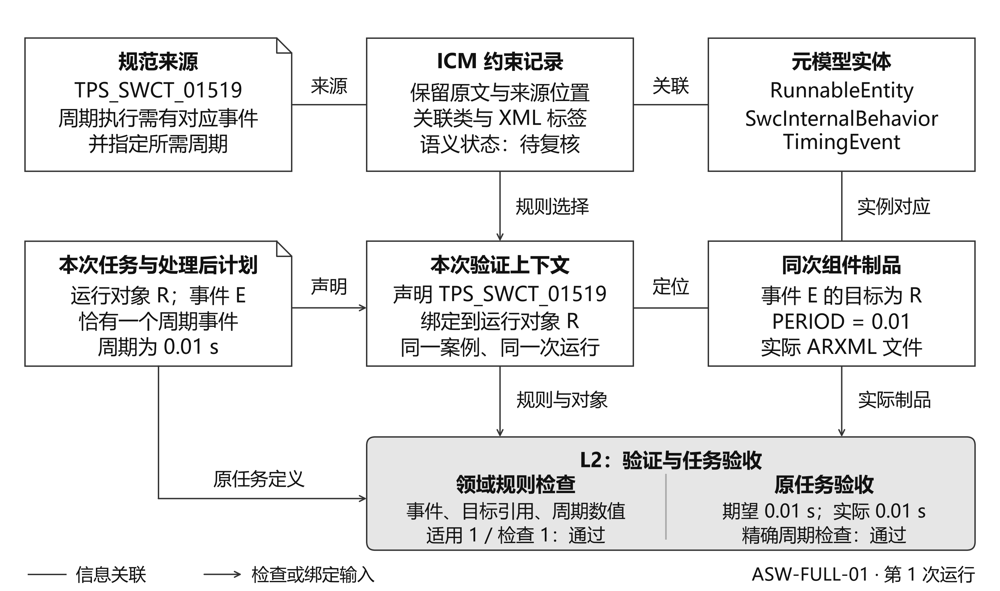
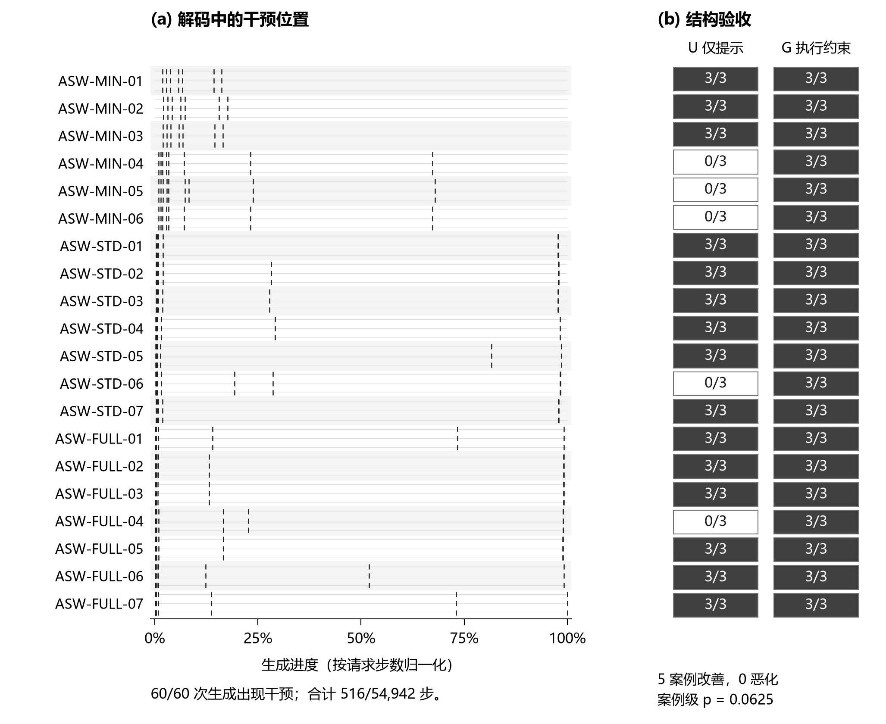

# 4 实验评价

本章评价 ATLAS 如何利用已有元模型与可执行检查能力，组织可追溯约束并支持候选模型的生成、验证和修复。评价分为三条相互衔接的证据：ICM 将规范要求、模型元素和检查实现关联起来；本地解码记录说明生成约束实际介入了词元选择；工程模型实验检查最终制品是否满足声明范围内的要求，以及验证反馈能否帮助修复。不同领域的结果分别解释，不合并通过率。

## 4.1 评价设计与案例来源

### 4.1.1 研究问题与实验分工

我们围绕四个问题组织评价。RQ1：ICM 能否将来源约束关联到具体模型对象和实际检查？RQ2：生成时执行结构约束产生了什么影响？RQ3：生成后验证与受限修复能否改善任务验收结果，其代价和局限是什么？RQ4：更换领域或生成模型后，哪些流程能够复用，哪些结论仍受实例范围限制？其中，ICM 采用实例追溯评价，解码和修复采用各自实验内部的对照；领域适配依据已实现的职责分析。这些问题用于组织已有及补充实验，并非全部实验运行前统一注册的研究计划。

表 4 实验对象及其证据角色

| 实验 | 任务与规模 | 主要证据 |
| --- | --- | --- |
| AUTOSAR 工程模型 | 20 个英文组件需求，各重复 3 次；另有受控故障 | 规范与元模型接入、ARXML 制品验收、受限修复 |
| 本地解码对照 | 20 个案例，各重复 3 次；U、G、A 三组 | 相同模型和提示下的解码干预及结构验收 |
| 铁路工程模型 | 24 个基础任务，各重复 3 次；Terra 另各 1 次；另有受控故障 | XMI 原生检查、原任务满足及修复对照 |
| 结构化法律决策 | 60 个英文合成情景，各重复 3 次；四组 | 检查、修订和发布策略的有限补充应用 |

工程模型的严格成功要求声明范围内适用的必需检查全部完成并通过。重复运行、生成文件和模型调用均不增加基础任务数。我们保留预定任务的分母，将拒绝赋值、未生成制品和未恢复失败计入结果；配对分析以案例或基础任务为单位处理相关性。AUTOSAR 与铁路提供主要工程证据，法律决策的完整设置与结果见附录 E。

### 4.1.2 需求设计与领域接入

AUTOSAR 描述汽车软件组件及其接口等模型，ARXML 是其 XML 交换表示。本实验覆盖组件、接口、端口，以及所需的 Runnable、内部行为和事件；一个任务可生成多个相互引用的文件。20 个需求由作者依据 Software Component Template、目标 XSD 和建模指导资料设计 [12]，并参考 ETAS 工具链中一个 RH850 工程的模型组合。作者对观察到的端口、Runnable、周期事件及数据访问结构进行去上下文化、分解重组和参数变化，形成 6 个最小、7 个标准和 7 个完整案例。它们是具有规范和工程依据的内部题集，非官方测试集或独立抽样的客户需求。逐项来源、设计选择及复杂度依据见附录 A 和复现材料中的需求来源说明。

铁路实验复用 Train Benchmark 的既有元模型和六条模型查询 [13]。24 个基础任务由作者设计的三类任务与八种布局组合形成。作者同时提供结构化任务规格，声明对象、任务义务和允许字段；确定性程序将其编译为约束与结构计划，LLM 选择已声明字段的取值。任务共享模板且在开发期间可见，因此该实例评价模型配置与修复，不评价任意自然语言到元模型或任务规格的自动提取。

两个工程实例均通过领域适配器构造候选模型并生成序列化制品。AUTOSAR 将任务分析结果、案例结构化规格及既有接口目录，与 Neo4j 中的元模型、约束和上下文结合，动态组装本次生成约束；返回的结构化内容经确定性处理后形成 ARXML。铁路将字段赋值装配为模型并输出 XMI。两者分别调用 XSD 及领域规则，或 EMF 模型诊断、VIATRA 原生查询及任务检查。自定义检查器采用 LLM 辅助人工编写，复用的原生验证器、规则模板和专用检查器共同构成 L2；实验未自动合成任意形式化验证程序。检查器构造、测试与覆盖见附录 B。

主实验的托管请求使用 gpt-5.6-luna、low；第二模型补充在相同 24 个铁路任务上使用 gpt-5.6-terra、low，设置与配对结果见附录 D。本地解码使用 Qwen3.5-9B、vLLM 与 XGrammar，以获得托管接口未提供的逐步观察。对照在各自实验内部进行，不依据不同模型、领域或终点间的通过率作方法排名。

## 4.2 ICM 的构建与约束追溯

ICM 的评价重点是能否将一项要求落实到模型对象及检查，而非知识库存量本身。图 6 展示一个已保存的周期 Runnable 检查实例：规范规则 TPS_SWCT_01519 关联到 Runnable、内部行为和 TimingEvent；任务上下文绑定具体 Runnable；运行时选择已有周期事件检查实现，检查事件存在、目标引用和周期的数值可解析性。保存的报告记录了一个适用对象、一个实际检查对象及通过结果。

这一实例也说明任务验收为何需要独立依据。事件存在且周期可解析，不意味着周期与需求一致。同一次运行的任务要求为 10 ms，独立任务验收将实际值 0.01 s 与案例要求比较后判为通过；仅与生成计划比较会遗漏计划本身的理解错误。因此，ICM 负责保留来源、实体和实现之间的关联，任务绑定落实本次对象与取值，原任务验收另行核对需求满足情况。

保存的 AUTOSAR 上下文包含 1,085 张约束卡片和 6,533 条约束关联，检查计划配置 554 条规则。结构化约束可同时服务于生成限制、检索提示和检查实现关联，并非互斥分类。现有材料支持复核这些信息的组织、绑定与使用；由于部分存量通过确定性恢复和显式整理形成，且缺少逐条独立语义参照，本实验不报告完整存量的 LLM 抽取准确率，也不估计元模型术语注入的独立收益。

铁路实例从结构化任务规格保留需求标识、模型字段、取值与检查项之间的对应，展示另一种约束构建入口。它与 AUTOSAR 共同支持 RQ1 中的组织和追溯能力；自然语言约束抽取质量仍需单独实验评价。

图 6 同一次运行的周期 Runnable 约束追溯及检查输入。R 为 RE_Com_Full_Baseline，E 为 TE_Com_Full_Baseline。规范要求所需周期，具体 0.01 s 来自任务；检查通过不改变规则仍待语义复核的状态。该图不展示修复。来源及检查范围见附录 B。

## 4.3 生成约束是否实际介入解码

本地实验直接考察生成过程中的约束执行。U 组在提示中提供完整契约；G 组使用相同提示并启用解码约束；A 组在 G 上增加逐步审计。三个条件在每个案例与重复组成的区组内共享模型、提示及采样设置，并平衡执行顺序。案例契约在运行前编译，此实验用于分析解码机制，与动态组装约束的完整 AUTOSAR 流程分别解释。

图 7(a) 显示，全部 60 次审计生成均记录到无约束最高分词元被执行语法排除的步骤，每次 7 至 10 步，合计 516/54,942 个可评价步骤，占 0.9392%。因此，保存的过程记录支持约束确实介入了局部词元选择。干预比例并不表示只有相同比例的内容受约束影响：早期词元选择可能改变后续生成状态，也不能由这一计数重建完整无约束路径。

图 7 保存的解码审计标记与结构验收对照。（a）20 个案例各三次生成，每案三行；短线标记语法排除无约束最高分词元的已记录步骤，相邻短线可能重叠。（b）同一案例在 U、G 条件下通过验收的次数。左图使用 A 的记录，A 与 G 的全部配对输出字节一致；两个面板不构成逐个干预步骤对最终成功的因果归因。

三组均生成可解析 JSON，但 U 仅有 45/60 个结果通过结构契约，G 与 A 均为 60/60。U 的 15 个失败集中于五个案例，涉及数组与对象类型、必需字段及访问引用的嵌套。案例级比较为五个改善、零个恶化、十五个持平；双侧精确符号检验 p = 0.0625，未达到 0.05 阈值。该结果描述了执行约束后观察到的改善，不能将重复运行作为独立案例增强统计支持。

G 与 A 的 60 对输出字节及输出词元数相同，审计组累计请求时间比 G 高 27.85%，配对平均增加 2.887 s。该对照说明此次运行中记录审计信息的开销，没有测量它相对于常规模型诊断工具的人工效率。历史完整得分和掩码未保存，离线复核能够核对标记、位置和计数，不能独立重算每一步标记的真值。配置、全部结果与留存范围见附录 C。

## 4.4 制品验收与受限修复

### 4.4.1 完整流程的验收范围

AUTOSAR 的 60 个流程输出全部通过声明范围内的原任务验收，共形成 255 份 ARXML。全部文件通过 XSD 检查，累计 2,418 项案例结构义务及 675 项本地引用检查未发现失败。这一结果属于包含任务分析、确定性处理、序列化和验证的完整流程，不能归为未经处理的 LLM 原始输出通过率。

这些输出在全部规范语料范围内仍记录为未完成，因为部分判断所需上下文或外部证据不在输入中。因而，实验支持声明的组件建模范围，不证明完整 ECU、RTE 或系统部署合规。对于受控修复，我们从通过验收的确定性参考工件束注入初始值错误、结构缺失或元素顺序错误；85 个核心适用单元均被检出并恢复，修复后文件集合及字节与参考一致。该结果说明预设故障的可恢复性；正式生成批次没有自然失败样本，不能据此估计自然故障修复率。另有 15 个预声明替代单元，单列于附录 A。

### 4.4.2 验证反馈带来的修复收益

铁路实验为修复提供具有自然生成失败的共享起点。G0 直接评价初始模型，GS 允许模型自行检查并修订，GF 加入验证诊断、定位信息与修改接纳控制；每个修复分支最多两轮。图 8(a) 显示，72 个起点的严格成功数由 G0 的 23 提高到 GS 的 29 和 GF 的 51，GF 相对 G0 提高 38.89 个百分点。48 个已形成制品的失败起点中，GS 恢复 6 个，GF 恢复 28 个；另一个未接纳初始赋值的失败仍保留在总分母中。

图 8 铁路模型的生成与修复结果。（a）Luna 的共享生成起点及两种修复条件。（b）Luna 在同一受控损坏输入下的 S、V、F 条件。（c）同一 24 个任务和固定种子的两模型比较，各模型的修复分支共享自身初始生成。面板分别使用 72、144、24 为分母，不合并样本；重复不增加基础任务数。

在受控损坏输入上，S 仅接收公共规则、当前模型和允许字段，V 增加验证结果及非回归接纳，F 进一步提供局部候选和依赖信息。成功数分别为 129/144、140/144 和 141/144。F 相对 V 净增一个成功，配对结果中四个单元仅 F 成功、三个仅 V 成功，未显示稳定的额外收益。因此，完整反馈方案在自然生成失败上具有观察到的收益，但局部定位相对于已有验证反馈的收益随故障条件变化；S 与 V 的差异还包括接纳策略，不能全部归于诊断信息。任务重采样分析及无需修改输入的保持检查见附录 D。

修复始终受原任务与允许编辑范围约束。例如，删除服务可能消除查询违反，却破坏服务要求；因此，原生验证通过之外，任务要求及受保护字段也参与接纳。GF 仍有 21/72 个起点未达到严格成功，反映了当前定位与编辑能力的边界。

同一 24 个任务、固定种子 104729 的补充比较见图 8(c)。Luna 的 G0、GS、GF 分别成功 6、8、13 个，Terra 分别成功 18、22、22 个，各以 24 为分母。Terra 的两种修复均比初始生成多通过四个任务，完整验证修复没有进一步提高总成功数。因此，另一模型设置中仍观察到修复收益，但结果不支持完整修复在不同模型上均优于自修复。该比较只有一个种子，输出上限差异及探索性检验见附录 D。

### 4.4.3 运行代价与人工工作

AUTOSAR 正式生成的流程用量为 11,967,476 token，平均流程时间为 64.712 s；85 个核心受控修复均在一个实际修复轮次完成，合计使用 661,631 token。生成与修复的输入范围不同，这些用量用于说明各自流程代价，不与本地解码的输出词元数作横向效率排名。铁路补充的实际调用和用量见附录 D。

领域接入仍包含需求设计、元模型适配、规则解释、检查器开发和测试。人工决定采用哪些规则与实现，运行时复用这些能力；现有实验没有完整记录适配工时，也未设置工程师生产率或人工接手效率对照。因此，本节量化自动修复及运行代价，不据通过率推导零人工成本或人效提升。

## 4.5 领域适配与补充应用

AUTOSAR 与铁路均生成具有领域结构及引用关系的工程模型，但接入资源和构造方式不同。前者将元模型、规范记录和图谱用于组件需求的动态绑定；后者从作者任务规格编译约束和结构计划，并连接已有原生查询。可以复用的是约束选择、对象绑定、模型构造、检查及修复之间的组织流程；元模型映射、序列化器、领域检查和允许编辑操作仍需适配实现。这两项实例支持有限范围内的领域适配，不证明对任意建模语言的自动迁移。

法律决策作为补充应用，未执行完整的元模型转换与 ICM 构建。60 个作者设计情景的参考判断由两位专家分别初评后讨论确定。完整策略在交付、参考兼容及发布条件组成的复合终点上达到 143/180，比已有检索和结构约束的设置提高 23.3 个百分点；案例配对 95% bootstrap 区间为 [13.3, 33.9]。增益属于审计、一次修复和发布策略的组合，结构约束的单独增益未获可靠支持。62 个修复单元中有 3 个由参考兼容变为不兼容，定向专家复核还发现机器通过但具体法院推论不成立的答案。因此，这些结果仅说明浅层结构化决策中的检查组织效果，不作为完整法律正确率或工程模型迁移的证明。完整对照、统计、设计者及专家职责见附录 E。

## 4.6 有效性威胁

评价结果首先受检查范围约束。序列化有效、元模型符合、领域约束满足和原任务满足不能相互替代；检查器仅判断已编码的性质。自定义检查器通过测试不意味着规则语义或覆盖完整，ICM 记录的关联数量也不是抽取准确率。AUTOSAR 中缺失上下文的规则，以及法律决策中的机器通过反例，均保留其限制。

内部有效性取决于比较条件。本地解码固定模型和提示并平衡顺序，铁路生成共享初始模型，但修复分支的执行顺序固定。部分修复对照同时改变诊断内容和接纳策略，无法分离所有组件的贡献。托管服务返回的模型名和 seed 也不保证底层模型身份可独立认证或确定性重放。第二模型补充覆盖全部预定任务，但仅使用一个固定种子，完成词元上限也与主实验不同；模型间比较保持描述性，不能据此评价重复稳定性或普遍模型优越性。

外部有效性受题集来源限制。AUTOSAR 为规范与工程观察支持的内部设计任务；铁路任务共享模板，PIL 支持库和检索器也在同一题集上开发。重复不增加需求多样性，受控故障不代表真实用户错误分布。当前数据不能推广到未见领域、工业规模系统或人工协作效益。统计报告保留不显著和负向结果，不将模型更换或追加修复天然视为改进。

复现材料提供任务、核心实现、模型输出、制品和检查结果，使读者能够离线复核已保留证据。AUTOSAR 的干预前任务分析正文和完整修复交互，以及本地解码的完整历史得分和掩码，未在已检查材料中定位；这些缺口不由处理后计划或后补示例替代。附录 F 说明材料入口及可复核范围。

## 参考文献

[12] AUTOSAR. Software Component Template. AUTOSAR Classic Platform Release 4.2.2. https://www.autosar.org/fileadmin/standards/R4.2.2/CP/AUTOSAR_TPS_SoftwareComponentTemplate.pdf

[13] Szárnyas, G., Izsó, B., Ráth, I., Varró, D. The Train Benchmark: cross-technology performance evaluation of continuous model queries. Software and Systems Modeling, 17, 1365–1393, 2018. https://doi.org/10.1007/s10270-016-0571-8
