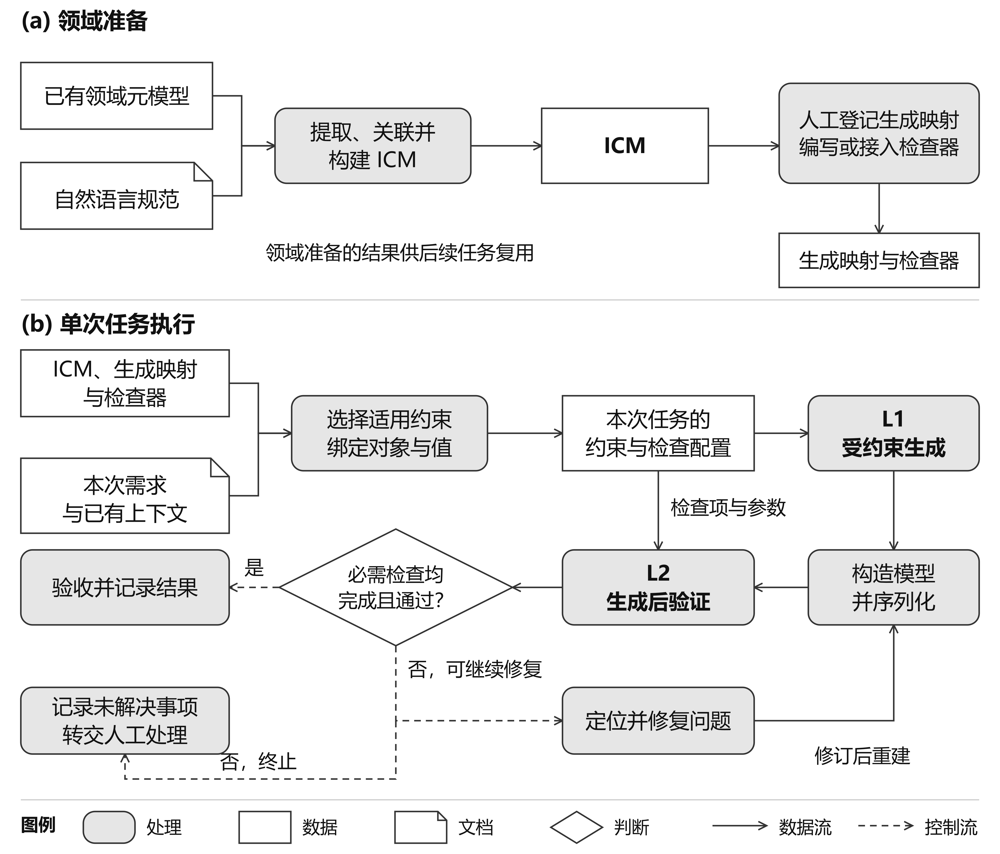
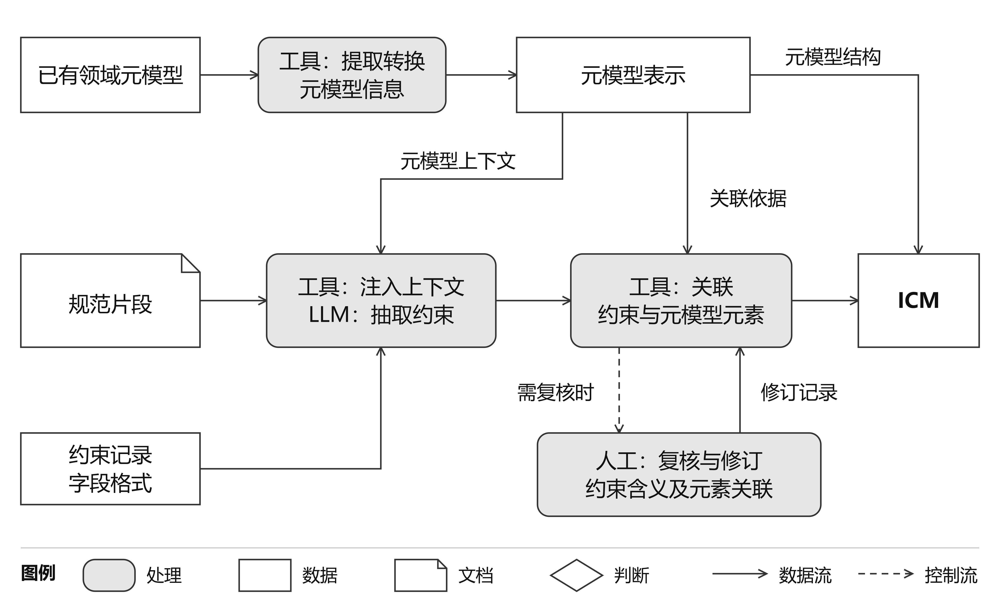
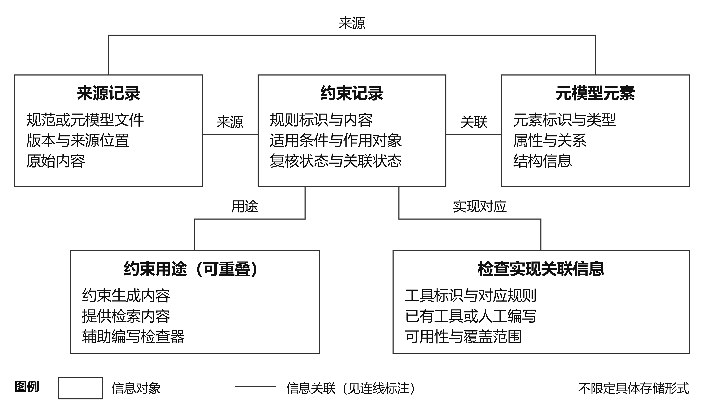
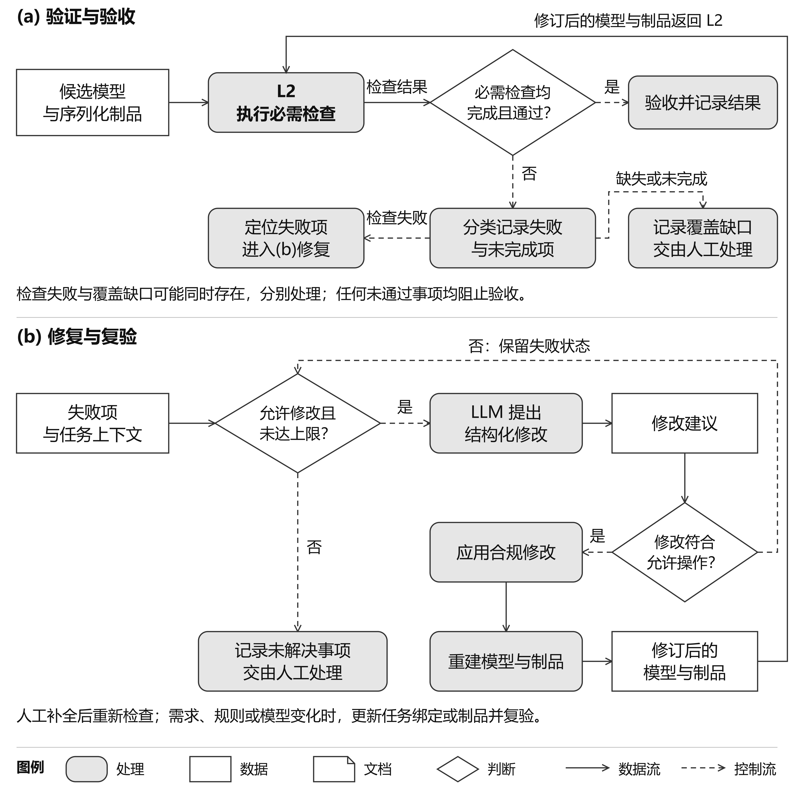

# 3 ATLAS 方法

ATLAS 是一种元模型引导的受约束生成方法，面向具有明确**领域元模型**（domain metamodel）、且能够将任务相关要求落实为生成时结构约束与生成后逻辑验证的任务。方法通过**集成约束模型**（Integrated Constraint Model, ICM）组织元模型信息、从自然语言规范抽取的结构化约束及其**可追溯关联**（traceability links），在任务上下文中选择约束并绑定对象与参数，支持**候选模型**（candidate model）的构造、验证与修复。本节说明 ICM 的构建及其在生成与验证两层中的使用方式。

## 3.1 适用范围与方法概述

ATLAS 的输入包括领域元模型、自然语言领域规范、任务需求和已有模型上下文。领域元模型可以直接复用，也可以在接入前由人工或外部工具形成明确表示。候选模型指以该元模型规定的类型与关系为依据构造、尚待验证和验收的模型；**序列化制品**（serialized artifact）指模型在目标语言或交换格式中的具体表示。本文以结构化制品作为更宽泛的输出总称；若某项实例化仅产生结构化决策记录，应说明其数据结构与领域概念的关系，不能仅凭 JSON 格式就将其视为已通过**元模型符合性**（metamodel conformance）检查的工程模型。

接入领域需要为目标任务提供两类执行能力：将具有既定映射的要求编译或组装为后端支持的生成时结构限制，以及在生成结果上执行必要的逻辑检查。生成时约束执行记为 L1，生成后验证记为 L2。两层共同覆盖本次任务声明的检查范围；L2 可以由普通程序、领域验证工具或形式化后端实现，其名称不意味着全部检查均采用形式逻辑。

适用条件针对任务所需的约束范围，不要求领域中的每一条规范均已可执行。尚无执行映射的约束可以保留为检索依据或验证器开发材料，其状态需要与可执行约束区分。某项必需要求缺少执行或人工评审依据时，系统必须报告覆盖缺口，不能将其视为已满足。ATLAS 对已有元模型进行信息提取与表示转换，不承担从自然语言构建新的领域元模型。验证器由领域适配者人工编写或接入，大语言模型（large language model，LLM）可以辅助开发。本文自定义的领域检查器采用 LLM 辅助人工编写的方式，原生格式检查由现有工具执行；任意自然语言规则到形式化验证程序的自动综合不属于本方法。

整体流程分为领域准备和任务执行。领域准备提取元模型信息，以元模型术语引导自然语言约束抽取，并建立约束与元模型元素的关联，形成可复用的 ICM。领域适配者据此登记生成映射，开发或接入检查器。任务执行结合本次需求与已有模型上下文，选择适用约束并绑定模型元素、取值和引用，形成任务约束。随后组装本次生成约束，将检索到的规范内容加入提示，并确定检查项及其参数，生成候选内容，构造模型及其序列化制品，并执行规定检查。可定位且属于允许编辑范围的问题进入受限修复与复验；其余问题保留为未解决事项。图 1 给出整体关系。

图 1 ATLAS 的领域准备与单次任务执行。领域准备产生 ICM、生成映射及人工编写或接入的检查器，供任务复用；本次任务绑定分别向 L1 和 L2 提供生成约束及检查配置。验收要求所有必需检查完成且通过。普通模型修复返回构造与验证；需求、规则等发生变化时，应相应更新任务绑定。图中重复出现的 ICM 与领域实现资源表示同一资源在两个分图中的引用。

近期模型驱动工程（model-driven engineering，MDE）研究将元模型上下文、显式结构控制和人工交互用于辅助模型生成 [1,2]。ATLAS 在这一背景下研究约束的组织与执行衔接：围绕元模型元素构建 ICM，再将领域规则与任务绑定结果衔接到生成限制、检索内容和验证检查。领域适配接口保持一致，具体元模型表示、目标语言及验证后端由接入领域确定；各实例化的实际覆盖范围在实现与实验部分报告。

## 3.2 提取与转换元模型信息

ICM 构建以已有元模型为起点。这一过程读取类及其他元模型元素的标识、属性类型、继承、包含与引用关系，以及任务需要的基数和枚举信息，形成后续抽取、查询与绑定能够使用的表示。转换后的记录保留源元素标识和版本，使自然语言规则、任务对象与验证结果能够关联同一领域概念。

交换表示可以采用对象模型、关系记录或图结构，具体存储格式不构成方法限定。模型驱动语言工程区分抽象语法、具体语法、约束及语言语义 [3]。相应地，元模型表示用于描述领域元素和关系；目标语言映射说明这些元素如何出现在序列化表达中；生成约束则规定本次允许生成的内容。三者可以采用相同交换格式，但作用不同。本文将前述转换界定为信息提取与表示转换；只有进一步明确源、目标模型及其元模型与转换规则时，才能据此讨论特定的模型到模型转换性质。

约束记录通过稳定标识关联到元模型中的类、属性、包含关系或引用关系，以明确其适用对象。执行具体任务时，再利用模型元素的标识和位置区分同一类型的多个实例。这两种关联分别支持领域规则复用，以及本次对象、取值和引用的绑定与检查。转换过程需说明保留了哪些信息及其源元素对应；其语义保留程度取决于实际转换规则。

## 3.3 元模型引导的约束抽取与 ICM 构建

ICM 整合两类约束来源。元模型直接提供属性类型、枚举、关系和基数等结构事实；自然语言规范提供实体组合、适用条件及行为要求，需要经过结构化抽取才能与元模型建立关联。两类记录保留各自的来源，以区分元模型声明与文本解释。本次任务指定的对象和值在任务执行时绑定。

自然语言抽取以文档片段为单位。抽取上下文注入片段所涉及的元模型类名、属性、关系和枚举术语，并以约束记录 schema 规定输出字段。LLM 据此抽取作用对象、适用条件及要求，同时保留来源位置。元模型术语为抽取提供共同的实体语境，用于减少新造概念和近义术语混淆；语义是否准确仍需对照原始规范判断。约束记录 schema 用于组织抽取结果，不等同于后续限制模型输出的生成约束。图 2 展示从已有元模型与规范片段到 ICM 的构建过程。

约束记录以独立字段保存作用范围、条件、要求与例外，并关联来源及使用状态。表 1 给出其主要信息；各字段可以分布于不同存储对象中，通过稳定标识关联。

表 1 ICM 约束记录的主要信息

| 信息 | 内容 | 后续作用 |
| --- | --- | --- |
| 标识与来源 | 规则标识、规范版本、片段位置及原始表述 | 支持回查和版本区分 |
| 约束内容 | 作用范围、适用条件、要求及例外 | 表达规则内容与适用边界 |
| 关联的元模型元素 | 涉及的实体、属性或关系及链接状态 | 支持规则检索与任务实体绑定 |
| 用途与实现关联 | 预期用途、已有结构映射或检查器标识 | 确定可以进入的执行环节 |
| 质量状态 | 语义复核状态、链接问题及未解决事项 | 区分候选、可用信息与待处理条目 |

图 2 从已有领域元模型及自然语言规范构建 ICM。元模型表示同时提供抽取上下文、元素关联依据和 ICM 的结构信息。人工复核按需修订约束含义及元素关联。图中省略记录级来源与状态字段；关联成功不等于约束语义已获确认，相关信息仍需保留。

抽取后建立约束与元模型元素的关联：解析记录中的目标名称，检查目标类型及其所属关系能否在元模型表示中找到，并保存已建立的关联。存在歧义或无法解析的目标应保留候选与问题状态，交由补充信息或人工复核后重新链接。链接成功只说明目标可定位，不能替代语义复核或证明规则可执行。未具备具体元素关联的抽象条目可以作为知识保存，但不能直接进入要求实体定位的生成或检查调用。

因此，ICM 构建依次完成元模型信息转换、上下文准备、结构化约束抽取、元素关联，以及来源、质量状态和用途关联的登记。可执行性由后续所需的映射和检查器是否可用确定，不由 LLM 的用途标签决定。人工复核可以纠正抽取含义或链接结果，其结果应形成明确状态；未复核条目不得被默认为已确认。

本文用以下四元组表示 ICM：

$$I = (M, C, A, P)$$

其中，$I$ 表示接入领域的集成约束模型，四个分量定义如下。$M$ 是提取和转换后的元模型表示，保存元素标识、类型、属性，以及所需的关系、基数和枚举信息。$C$ 是持久保存的领域约束记录集合，包括从规范抽取的约束，以及需要单独引用的元模型结构规则；记录保存约束内容、适用条件、用途、已有实现关联和复核状态。$A$ 保存约束记录与元模型元素之间已经建立的关联，用于定位约束的作用对象。$P$ 保存元模型元素和约束记录的来源信息及对应关系，包括原始元模型或模式文件、自然语言规范的版本及具体位置。

一条约束可以关联多个元模型元素，同一元素也可以涉及多条约束；内容与来源之间同样可以具有多个对应关系。尚未解析的目标、缺失来源及未完成的复核应保留相应状态，不作为已经确认的关联使用。只有具备所需元素关联和执行映射的记录，才能进入依赖这些信息的生成或检查步骤。

这一表示说明 ICM 需要组织的信息，不限定存储形式。其作用是连接规范来源、元模型元素、约束内容及后续用途；约束的语义仍需结合原始规范复核，可执行性则取决于已有映射和检查实现。图 3 展示相应的信息结构。

ICM 约束具有表 2 所列的三种用途。同一条约束可以参与多种用途，因此三者不是互斥划分，也不与 L1、L2 两层执行逐一对应。

表 2 ICM 约束的用途与执行关系

| 用途 | 使用方式 | 作用范围 |
| --- | --- | --- |
| 生成时结构约束 | 通过已有映射编码为类型、必需项、数量、枚举或候选引用限制 | 限制已编码且受后端支持的生成空间 |
| 检索提示 | 按任务实体和适用条件检索规则，提供来源与上下文 | 为设计和生成提供依据，满足情况另行检查 |
| 验证器开发依据 | 人工结合规则、原始规范和元模型编写或接入检查，LLM 辅助 | 将明确要求落实为可调用的验证能力 |

以一个简化工作流模型为例，任务通过输入引用使用数据对象，领域规则要求“导出任务只能使用已审核的数据”。该规则链接到任务、数据及输入关系；它可以用于筛选候选输入、作为检索提示，并辅助实现检查实际引用和审核状态的验证器。三种用途需要的上下文不同，候选筛选依赖可用数据目录，制品检查还需确认最终引用的对象及状态。将元模型结构事实、文本抽取约束、元素关联、来源及使用条件组织为同一可追溯信息模型，是 ICM 构建的核心；后续任务执行在这一组织关系上选择和绑定所需信息。

图 3 ICM 所需信息及其关联的逻辑视图，不限定具体存储字段或实现形式。约束记录与元模型元素分别关联其来源；约束的三类用途可以重叠。检查实现关联信息描述已有工具或人工编写的实现及其覆盖范围，不表示由 LLM 自动生成验证器。

## 3.4 提取任务要求并绑定对象和取值

持久 ICM 描述可跨任务复用的领域信息。任务需求则规定本次对象数量、结构选择、取值、引用目标或其他条件。系统将这些要求与适用领域规则、已有模型上下文结合，选择相关约束，再将要求绑定到具体模型元素和取值，形成仅对本次任务生效的约束。这些临时约束可以来自自然语言需求，但不自动成为领域规则，也不自动产生新的验证程序。

对于需要多对象协调的任务，可以先形成设计，明确待构造对象及其关系，再逐步生成组成部分。设计由 LLM 辅助形成，并由确定性适配与必要的人工判断落实到可处理的实体和位置；简单任务可以直接完成绑定，不要求所有领域统一采用两阶段生成。若需求同时具有结构化输入，其优先级及与 LLM 推测发生冲突时的处理规则应预先明确。

这个步骤以 ICM、本次需求、已有模型上下文和可选设计为输入，输出本次任务需要满足的约束及其对象与取值。随后，具有生成映射的约束用于限制输出；检索到的规范内容加入提示；需要生成后检查的要求则落实为已有检查器及其调用参数。无法表达、相互冲突或尚不能绑定的要求单独保留。检查项与参数说明本次检查什么、调用哪个已有检查器及使用哪些输入，运行时不因此生成新的验证代码。

任务绑定需要明确需求来自何处、哪些绑定由 LLM 提出、哪些由确定性规则或人工确认。无法绑定的引用、相互冲突的取值及尚未支持的要求应作为未解决事项保留，不能通过扩大允许值或忽略检查来默认为有效。这里执行的是适配器支持的绑定与一致性检查，不等同于对全部领域规则和任意自然语言需求进行全局可满足性求解。

在工作流示例中，本次需求可以指定导出任务使用某个已有数据对象。任务绑定先解析该对象，再结合领域规则检查其审核状态；指定对象与状态信息共同影响生成候选和验证参数。对象身份属于本次任务，“导出任务只能使用已审核的数据”属于可复用规则。任务约束仅在当前运行和修复中生效，不自动写回持久 ICM；保存其运行记录不改变其作用范围。图 4(a) 展示三类输出：本次生成约束、供提示使用的检索内容，以及检查项与调用参数。它们与表 2 的三种用途相关：验证器在领域准备时开发或接入，本次执行只确定要调用的检查项及其参数。

## 3.5 组装生成约束与受约束解码

### 3.5.1 从任务约束到生成约束

系统依据已有映射，将本次任务中能够由所选后端执行的要求组装为生成约束，规定允许输出的字段、类型、数量、固定值、枚举和候选引用。JSON Schema 是此类结构和值约束的一种表达方式 [4]；方法不限定具体约束语言，但要求说明编码范围、后端支持能力及返回值的检查方式。图 4 将任务绑定与后端解码机制分开表示。

动态组装结合元模型信息、任务设计与已有模型上下文。元模型提供允许的类型、关系及取值范围，任务需求进一步绑定对象、数量和值，模型上下文提供当前可用引用。适配器通过已有映射将这些信息落实到本次生成约束。尚有多个合法取值时保留候选集合；已经确定的内容可以成为固定值，并由确定性程序负责对象身份、结构组织及序列化。依赖尚未构造对象的引用仍需在完整制品上检查存在性。

工作流示例中的输入引用，可以先从已审核且类型兼容的数据对象中形成候选集合；若任务指定其中一个对象，该字段便收敛为固定值。若所有字段均已绑定，生成约束可以只允许一个结构化值，这表示该阶段没有剩余取值决策。值空间为单解不等于唯一文本或唯一词元（token）序列；空白、键顺序及词法形式是否存在变化，取决于实际接受的语法。

能够在生成时执行哪些约束，取决于已有映射与后端能力。约束语言能够描述某种要求，不代表所选解码后端一定完整执行它。兼容转换保留原始要求关联，并以原生成约束和已配置检查核对返回值。无法在 L1 执行的要求可以交给已接入的生成后检查；缺少对应检查能力时保留覆盖缺口。

### 3.5.2 解码时的合法候选与状态更新

**受约束解码**（constrained decoding）将输出格式及已编码限制落实到逐步生成过程，是已有的结构化生成技术 [5]。采用可控制的解码后端时，本次生成约束先转换为后端支持的语法，再结合模型分词器进行编译，形成匹配器能够使用的表示 [6,7]。图 4(b) 展示这一过程。

匹配器依据当前语法状态检查候选词元，确定下一步允许输出的内容。一个词元可能覆盖多个语法符号，也可能只包含一个字符的部分字节，因此词元边界不等于字符边界，后端需要处理词元与语法的对应关系 [6]。

在每一步中，LLM 给出下一词元的未归一化得分（logit），后端依据匹配结果施加掩码，将不允许词元的得分设为负无穷，再按采样配置从允许候选中选择；贪心解码则选择其中得分最高的词元。所选词元被追加到输出，匹配器更新状态，随后重复上述步骤。普通词元的筛选与完整结束的判定分别由后端处理，允许继续生成不等于输出已经完成；若既无可选词元也不能合法结束，则报告解码失败。

检索提示提供领域依据和任务含义，帮助模型选择输出内容；掩码排除违反已执行生成约束的延续。掩码会改变模型原有的输出分布，逐步过滤并不一般等同于在完整输出满足语法的条件下从原模型采样，也不能保证剩余候选满足领域要求 [8]。

### 3.5.3 完整结束、模型构造与序列化

L1 的结构保证以语法编译、分词器对齐及掩码执行正确为前提，并相对于实际执行的语法成立。完整结束由后端协议判断，可以通过结束词元，也可以在根结构完成后停止。合法前缀不保证在给定时间或词元预算内完成；超时、截断和后端异常应作为未完成或失败处理，不能计为结构通过，也不假定存在通用的截断后自动闭合程序。

对于托管结构化输出接口，方法通过提交生成约束并检查返回值接入后端。可记录的证据包括实际 schema、响应与结束状态；仅凭接口调用不能证明服务内部逐词元的掩码过程。可观测的本地执行与托管接口因此共享约束输入和结果检查边界，但支持的机制分析不同。

生成结果先按本次生成约束检查，再由领域适配器完成模型构造与序列化，包括对象创建、包含关系组织、引用落实和目标表达生成。候选模型与序列化制品可以分别表示，也可以由领域工具通过同一持久化表示处理，但应明确各项检查实际作用的对象。生成的结构化赋值满足生成约束，并不直接推出构造后的候选模型符合元模型或满足全部任务要求；构造后的检查用于确认这些要求在模型及其目标表达中得到落实。

图 4 本次任务的约束选择、对象和值绑定，以及后端编译和受约束解码。图中数据记录均不意味着自动写回持久化 ICM。编译和词元筛选受后端及分词器实际支持范围限制。解码分图表示正常迭代路径；空候选且不能合法结束、后端异常或预算截断直接记录为失败或未完成。接收完整输出要求满足完整语法和后端结束协议，不意味着所有语义检查均已通过。每次循环使用更新后的匹配状态和当前 LLM 得分。

## 3.6 生成后验证与任务验收

生成后验证依赖领域适配阶段提供的可执行检查能力。对于 ICM 中需要由 L2 检查的约束，首先确定其所约束的模型元素、适用条件、待检查关系或取值，以及判断所需的上下文。结构化约束及其元模型实体关联为这一过程提供依据；只有落实了这些信息，规范语句才能转化为具有明确输入和判定条件的检查项。若判断还依赖模型之外的部署信息、运行轨迹或人工解释，应明确记录所需证据及其获取方式。

检查能力可以通过三种方式获得。已有建模平台或领域工具支持的性质，通过适配接口调用原生验证器；能够用已有操作表达的性质，例如取值范围、基数和引用存在性，通过规则模板或声明式规则语言装配检查；其余能够自动判断的性质，由领域适配者实现专用检查器。当前实现采用 LLM 辅助人工编写检查器：LLM 可以帮助整理规则、提出代码和测试候选，规则解释、实现选择及采用决定由人工负责。ATLAS 的方法范围包含约束与已有检查能力的关联及调用，不包含从自然语言自动合成任意形式化验证程序。

检查器投入使用前，应以满足和违反规则的模型测试判定结果，并根据适用范围补充边界取值、缺失上下文和引用异常等测试；发生修改后执行相关回归测试。通过测试的实现注册到可调用的检查集合，并记录关联规则、输入对象、参数、适用前提及诊断信息。测试支持对实现行为的检查，不构成规则语义完全正确或领域覆盖完整的证明。尚未实现、尚待确认或缺少必要证据的检查项，应保留其状态，不能随已实现检查一起默认为通过。

任务执行时，从 ICM 选择适用约束，将本次任务涉及的对象、取值和引用范围绑定到已有检查器。临时任务要求不必进入持久 ICM，但其依据、绑定和执行结果应保存在运行记录中；只有现有检查能力能够表达这些要求时，才能据此自动装配检查项。需要新增判定逻辑的要求进入领域适配或人工处理。L2 随后对**候选模型**（candidate model）及其**序列化制品**（serialized artifact）执行配置的检查，返回规则标识、对象或制品位置、判定结果和相应证据。检查报告同时说明适用范围与实际完成情况，以区分不满足要求和未能完成判断。

L1 与 L2 按表达能力、执行成本和上下文需求分工，同一项要求可以在两层以不同形式落实。能够转化为生成时结构限制的要求可由 L1 执行；需要在候选模型或制品上求值，或超出当前 L1 支持能力的要求由 L2 检查。生成时的有限候选限制也可能落实部分领域要求和跨对象关系，已有研究也探索在部分模型构造期间执行语义检查 [9]。因此两层分工不等同于将全部语法归于 L1、全部语义归于 L2。

验证结果从四个方面报告：序列化格式是否有效、模型是否符合元模型、领域约束是否满足，以及原任务的**需求满足**（requirements satisfaction）情况。元模型符合性涉及类型、属性和关系等规定，**良构约束**（well-formedness constraints）还可能涉及跨元素的一致性；格式标准本身也可能表达部分内容约束 [10]；这些维度可能由同一检查共同覆盖，应明确其实际判断范围。检查制品是否符合 LLM 拟定的计划，只能发现计划与制品之间的不一致。任务验收还需要独立于该计划的原需求依据，以发现计划本身的遗漏或误解。

验收范围在生成前确定，明确本次任务的必需检查及其适用条件。所有适用的必需检查执行完成且通过后，任务才可在声明范围内验收；不适用判断须有可核对的依据。执行异常、缺少必要上下文、无法确定适用性或缺少实现，应报告为未完成或覆盖缺口。非必需检查单独报告，不据其结果隐含改变验收范围。需要人工判断的必需性质，应纳入评审及结果记录，尚无结论时保持未完成状态。

验收结论说明制品满足了哪些已配置并完成的检查，其有效性受检查实现和声明范围限制。人工在构造阶段确认规则含义，与运行阶段评审模型之外的性质，承担不同职责；两者均应按实际参与情况报告。

## 3.7 根据验证结果修复模型

模型修复研究通常以不一致定位、编辑操作和修复候选为基本对象 [11]。ATLAS 从具体的验证失败项出发进行修复，利用规则标识、模型或制品位置以及模型元素标识，将问题定位到当前任务状态中的可修改位置，并确定允许的编辑操作。自动修复范围取决于已经实现的定位和修改能力；无法定位、超出允许操作或依赖未建模判断的问题，需要保留失败原因并交由人工处理。图 5 分别展示验收判定以及失败后的修复与复验。

对于可处理的问题，LLM 接收相关规则、失败诊断、候选位置及编辑约束，提出结构化修改。确定性程序检查修改是否符合允许操作，再将其应用到任务执行状态，重新构造制品并执行规定的检查。修复可以使用生成阶段的约束规范限制修改表达，但修改能否解决原问题仍由复验决定，不能把 LLM 提出修复建议等同于修复成功。

修复循环具有预先规定的尝试上限和编辑范围。每次修改保留制品版本、修改内容及复验结果；通过验收后结束，达到上限仍未满足要求则保留未解决事项并终止自动处理。该过程不保证最小修复或能够修复所有失败项，也不自动改变持久 ICM 或放宽任务验收条件。若人工决定改变需求、规则或允许操作，应形成显式版本变更，重新绑定对象和取值，并更新生成约束、检查项与参数，再按新的声明范围构造和检查。

图 5 L2 检查结果驱动的验收、修复与复验。检查失败和覆盖缺口可能同时存在，按问题分别处理，任何未通过事项均阻止验收。修复受允许操作和尝试上限限制；拒绝不合规修改时保留失败状态。应用修改后重建模型或制品并返回 L2。人工补全信息后重新检查；需求、规则或模型变化时，更新相应任务绑定或制品并复验。图示不新增“全部检查完成后才能修复”的执行策略。

人工接手时需要获得当前制品、失败规则与位置、已有尝试、尚缺信息和可修改范围。补全评审或必要上下文后，重新执行受其影响的检查并确认全部必需检查状态；修改模型或序列化制品后，重新构造并验证。验收状态依据复验结果更新。这里规定的是人工交接接口；具体编辑工具、介入频率和实际工作量由实例化及评价报告，不以接口存在推断人工参与效果。

## 3.8 领域适配与可追溯性

ATLAS 以表 3 所列接口连接通用流程与领域实现。方法规定输入输出及检查责任，领域适配者提供元模型映射、制品构造和验证等实现。迁移所需工作由这些接口的已有支持和目标领域要求决定，不能仅依据采用相同文件格式判断两个领域具有相同适配深度。

表 3 ATLAS 的领域适配接口

| 接口 | 输入 | 输出与责任 |
| --- | --- | --- |
| 元模型转换与查询 | 已有元模型及必要的语言映射 | 可查询表示、源元素对应及可解析的元素标识 |
| 选择和组装约束 | ICM、需求、已有模型上下文及可选设计 | 任务约束、生成约束、检索内容、检查项与参数和未支持事项 |
| 模型构造与序列化 | 生成结果与任务执行状态 | 候选模型、引用关系及序列化制品 |
| 验证调用 | 候选模型及制品、检查项、调用参数与已有检查器 | 规则与位置关联的结果、异常或覆盖缺口 |
| 定位与修改 | 失败项、模型元素标识及允许操作 | 可编辑位置、经检查的状态修改或人工交接 |

运行记录贯穿上述过程，通过可追溯关联连接任务标识、领域资源版本、实际生成约束、LLM 响应、候选模型、序列化制品、验证报告及修改前后版本。LLM 提出的内容、确定性补充和人工修改需要能够区分，以便追查一项要求在哪个环节得到落实。任务约束虽不写入持久 ICM，仍可随运行记录保存以支持本次结果复核。

运行记录的粒度由后端可观测能力和实际留存决定。证据报告需要说明哪些内容能够核对、哪些信息缺失，以及这些限制影响哪些分析。过程记录用于追查生成与修改过程，其完整性或一致性不能替代模型或制品检查，也不构成领域正确性的证明。可追溯关联本身也不意味着已经实现自动同步或变更影响分析。

实现与实验部分据此说明各领域提供了哪些适配组件、执行了哪些检查，以及保留了哪些证据。方法的适用条件、实例化的支持范围和实验所得结论分别陈述，使读者能够判断可复用的是流程与接口，哪些能力仍需要目标领域的实现和验证。

## 参考文献

[1] Chen, B., Wei, O., Zheng, B., Mussbacher, G. Accurate and Consistent Graph Model Generation from Text with Large Language Models. Proceedings of MODELS 2025, pp. 130–141. https://doi.org/10.1109/MODELS67397.2025.00018

[2] Almonte, L., Rengifo, J. I., Guerra, E., de Lara, J. EMF-Kaizen: an intelligent assistant for domain-specific modelling and meta-modelling. Journal of Object Technology, 25(3), 2026. https://doi.org/10.5381/jot.2026.25.3.a8

[3] Tolvanen, J.-P., Kelly, S., Di Rocco, J., Pierantonio, A., Tinella, G. A framework for evaluating tool support for co-evolution of modeling languages, tools and models. Software and Systems Modeling, 24, 311–338, 2025. https://doi.org/10.1007/s10270-024-01218-5

[4] JSON Schema. JSON Schema Validation A Vocabulary for Structural Validation of JSON. Draft 2020-12. https://json-schema.org/draft/2020-12/json-schema-validation

[5] Geng, S., Josifoski, M., Peyrard, M., West, R. Grammar-Constrained Decoding for Structured NLP Tasks without Finetuning. Proceedings of EMNLP 2023, pp. 10932–10952. https://doi.org/10.18653/v1/2023.emnlp-main.674

[6] Dong, Y., Ruan, C. F., Cai, Y., Lai, R., Xu, Z., Zhao, Y., Chen, T. XGrammar: Flexible and Efficient Structured Generation Engine for Large Language Models. Proceedings of Machine Learning and Systems, 7, 2025. https://proceedings.mlsys.org/paper_files/paper/2025/file/5c20ca4b0b20b0bd2f1d839dc605e70f-Paper-Conference.pdf

[7] Li, L., Dong, Y., Wang, G., Xu, Z., Jiang, A., Chen, T. XGrammar-2: Dynamic and Efficient Structured Generation Engine for Agentic LLMs. arXiv:2601.04426v4, 2026. https://arxiv.org/abs/2601.04426v4

[8] Park, K., Wang, J., Berg-Kirkpatrick, T., Polikarpova, N., D'Antoni, L. Grammar-Aligned Decoding. Advances in Neural Information Processing Systems, 37, 2024. https://doi.org/10.52202/079017-0774

[9] Chen, B., Hernández López, J. A., Babikian, A. A. Projectional Decoding: Towards Semantic-Aware LLM Generation. Proceedings of FSE Companion 2026. https://doi.org/10.1145/3803437.3805571

[10] W3C. XML Schema Part 1 Structures Second Edition. W3C Recommendation, 28 October 2004. https://www.w3.org/TR/xmlschema-1/

[11] Marchezan, L., Kretschmer, R., Assunção, W. K. G., Reder, A., Egyed, A. Generating repairs for inconsistent models. Software and Systems Modeling, 22, 297–329, 2023. https://doi.org/10.1007/s10270-022-00996-0
