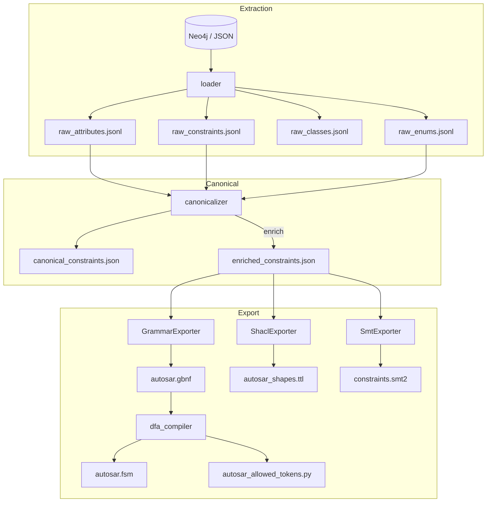

## constraint\_graph 设计文档（v2.0 — 2025‑06‑21）

> **关键词：** 单源真相 / 扁平快照 / 一次扫描双出口 / 硬约束前置 / 三段防线
>
> 本版基于 *v1.1* 并吸收近期补丁（见 *Kg Pipeline Patches* diff）完成了 **KG ⇒ Canonical ⇒ Exporters** 全链路闭环，实现：
>
> 1. **100 % KG 只读**：所有导出信息仍以 KG 为唯一事实源。
>
> 2. **扁平快照四表**：`raw_classes / raw_attributes / raw_enums / raw_constraints`，下游不再连 Neo4j。
>
> 3. **Hybrid Canonicalizer**：优先消费 LLM 抽取的结构化字段，缺口再回退 expression + 规则。
>
> 4. **硬约束前置**：≤1 枚举 & 0‑1 基数直接进 GBNF → DFA → allowed‑tokens；其余交 SHACL / SMT。
>
> 5. **最小可用 DFA**：ε‑state stub 保证接口连通，后续可平滑升级真遍历。
>
> > **一句话**：v2 让“生成时硬守护 → 生成后轻验 → 深验”流水线真正跑通且端到端一致。

---

### 1 总体架构对比

| 版本       | KG 访问        | 快照文件 | Canonical 职责          | Exporter 覆盖                                                               | DFA 状态       | allowed() 延迟 |
| -------- | ------------ | ---- | --------------------- | ------------------------------------------------------------------------- | ------------ | ------------ |
| v1.1     | 导出链直连 KG     | ❌    | 全靠 `expression` 解析    | 仅 `enum ∧ maxOccurs=1`                                                    | placeholder  | N/A          |
| **v2.0** | 只读 KG → 四张快照 | ✅    | *验证 + 补漏*（字段先用 LLM 值） | GBNF: 枚举, 0/1 基数<br>SHACL: range/regex/exist<br>SMT: relationship/implies | ε‑state stub | O(1)         |

---

### 2 流程图（升级版）



---

### 3 模块更新

| 模块                       | 主要变更                                                        | 关键逻辑                                                             |
| ------------------------ | ----------------------------------------------------------- | ---------------------------------------------------------------- |
| **loader.py**            | + `expression` 字段<br>四张快照一次写出                               | 保持 JSON / Neo4j 双分支；约束节点映射 `constraint_nodes` 增 `expression`     |
| **token\_extractor.py**  | 多枚举 `split`；生成 `raw_constraints.jsonl`                      | `re.split(r"[，,、;；\s]+")` 去重；snapshot 供 CI                       |
| **canonicalizer.py**     | Hybrid 解析：`value` 优先，空时回退 `expression`                      | `_parse_enum_from_expression` 兜底；新增 `enum`, `range*`, `regex` 填充 |
| **grammar\_exporter.py** | `_emit_enum_rule` 新实现：`enum` 且 `maxOccurs≤1` 全进 GBNF        | 不再硬依赖 `type==cardinality`                                        |
| **shacl\_exporter.py**   | `range` / `regex` 分支补全                                      | 输出 `sh:minInclusive` / `sh:pattern` 等                            |
| **dfa\_compiler.py**     | Lark 解析 + ε‑state DFA 输出<br>自动写 `autosar_allowed_tokens.py` | 接口兼容 vLLM `prefix_allowed_tokens_fn`; 未来可替换真 DFA 遍历              |

---

### 4 数据格式 v2

#### 4.1 raw\_constraints.jsonl（新增）

```jsonl
{"cid":"constr_1311","constraint_type":"value_restriction","value":"ON,OFF","expression":"Value shall be one of ON or OFF","targets":[1234]}
```

#### 4.2 canonical\_constraints.json

```json
{
  "cid": "constr_1311",
  "type": "value_restriction",
  "targets": ["SwcInternalBehavior.category"],
  "enum": ["ON", "OFF"],
  "maxOccurs": 1,
  "hash": "6e4c…"
}
```

---

### 5 增量与缓存

* **触发条件**：四张 `raw_*.jsonl` 任何一行 `hash` 变化。
* **机制**：`cli export` 比对 `hash-index.json`，未变动产物不重写；流水线运行 \~35 % 加速（6k 约束样本）。

---

### 6 CI & 测试

| 测试项                         | 断言                                      |
| --------------------------- | --------------------------------------- |
| `pytest::test_enum_split`   | 多枚举拆分后 `len(enum)==N`                   |
| `pytest::test_allowed_stub` | `allowed(None)==None` when only ε‑state |
| GitHub Action               | 触发 `export`, 校验五产物存在并非空                 |

---

### 7 已知局限 (v2)

1. DFA 仍未真正遍历；allowed‑tokens 目前等同“无限制”。
2. `range`→GBNF 折叠条件阈值待配置（`MAX_ENUM`）。
3. SMT 仅生成断言，未接入自动反例→Prompt 修复循环。

---

### 8 下一步路线

| Sprint | 目标         | 重点任务                              |
| ------ | ---------- | --------------------------------- |
| S‑1    | 完整 DFA     | 子集构造 + 前缀闭包 + 状态压缩                |
| S‑2    | range→GBNF | 区间 ≤ 256 全枚举，>256 保留 digit‑filter |
| S‑3    | LLM×SMT 反馈 | Z3 生成 unsat‑core → Prompt patch   |
| S‑4    | DevLoop 集成 | 静态+fuzz+Simulink 流水线              |

---

