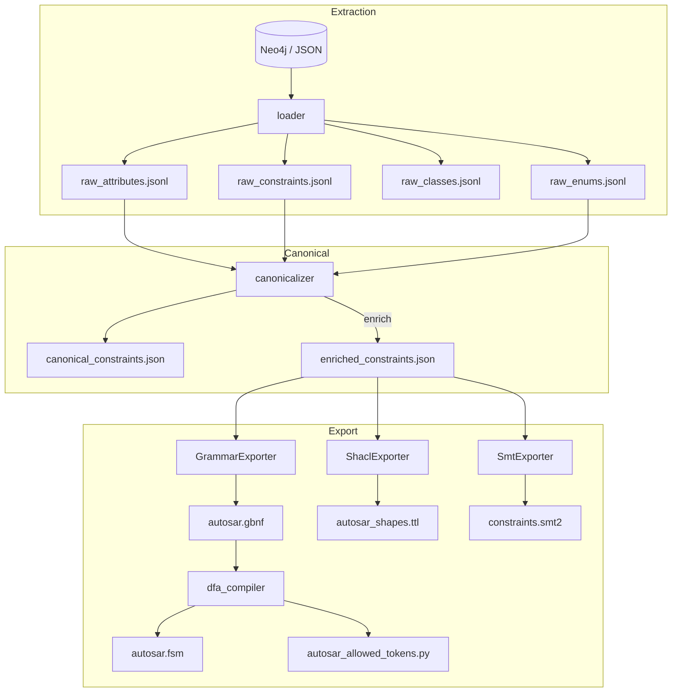

## constraint\_graph 设计文档（v3.1 — 2025‑06‑23）

> **关键词：** 单源真相 / 扁平快照 / 真 DFA / 逐步硬约束 / 三段防线 / *跨实体关系*
>
> v3.1 在 v3.0 的基础上 **补全“关系型约束”**（cross‑entity / implies），实现从 KG → SMT 的自动转换，并更新约束‑产物映射。

---

### 1 变更概览（v3.0 → v3.1）

| 主题                      | v3.0                          | **v3.1 改动**                                           |
| ----------------------- | ----------------------------- | ----------------------------------------------------- |
| **Relation Constraint** | 仅识别 `implies` 字段              | + 支持 JSON DSL：`{"if": A, "then": B}`<br>+ 跨类存在性、跨属性依赖 |
| **smt\_exporter.py**    | `_existence / _range / _enum` | + `_relation()`  → 生成 `=>` 子句、实例化函数                   |
| **文档**                  | 无专节                           | + §10 “关系型约束示例与转换”                                    |

---

### 2 总体架构（v3.1）



---

### 3 文件与约束类型映射

| 产物文件                            | **约束字段**                                    | 转换链路 & 用途                                                  |
| ------------------------------- | ------------------------------------------- | ---------------------------------------------------------- |
| **autosar.gbnf**                | `enum`, `(maxOccurs==1 ∧ enum=None)`        | GrammarExporter → LLM 解析器强语法                               |
| **autosar.fsm**                 | GBNF 全量终端                                   | dfa\_compiler → 前缀 DFA 状态机                                 |
| **autosar\_allowed\_tokens.py** | 同上                                          | dfa\_compiler → 推理期 `allowed(prefix)`                      |
| **autosar\_shapes.ttl**         | `range`, `regex`, `min/maxOccurs`           | ShaclExporter → 生成后轻量验证 (pySHACL)                          |
| **constraints.smt2**            | `range`, `relation`, `implies`, `cross‑ref` | SmtExporter → Z3/CVC5 深度验证；关系型约束以 `=>`, `and`, `exists` 编译 |
| **raw\_\*.jsonl**               | KG 原生属性                                     | 所有下游导出基线；支持行级哈希增量                                          |

> **关系型约束**（relation）示例：
>
> ```json
> { "if": "BswM.Mode==OFF", "then": "Swc.Category in {APPLICATION}" }
> ```
>
> 由 SmtExporter 编译为：
>
> ```smt2
> (assert (forall ((pkg Pkg))
>   (=> (= (BswM_Mode pkg) OFF)
>       (= (Swc_Category pkg) APPLICATION))))
> ```

---

### 4 dfa\_compiler 关键算法（摘要）

```python
# 1. GBNF → EBNF 预处理
ebnf = gbnf_to_ebnf(gbnf_txt)
parser = Lark(ebnf, parser="lalr", start="ROOT")

# 2. 遍历 Lark 状态 → DFA
dfa = {}
frontier = [()]
while frontier:
    prefix = frontier.pop()
    allow  = allowed_terms(parser, prefix)
    dfa[prefix] = allow
    if len(prefix) < MAX_DEPTH:
        frontier.extend(prefix+(t,) for t in allow)

# 3. dump FSM + allowed_tokens.py
```

---

### 5 关系型约束转换逻辑

| DSL 字段                 | 例子                                           | SMT 片段                                              | 备注      |
| ---------------------- | -------------------------------------------- | --------------------------------------------------- | ------- |
| `{"if": A, "then": B}` | `if: ClassA.flag==1`<br>`then: ClassB.exist` | `(=> (= Flag 1) (exists ((b B)) (ClassB_exist b)))` | 跨类存在性   |
| `requires`             | `Swc.port requires OsApplication`            | `(=> (PortExist p) (OsApplicationExist app))`       | 支持多对多   |
| `mutex`                | `AttrX mutex AttrY`                          | `(not (and X Y))`                                   | 编译成互斥断言 |

---

### 6 运行时接口

同 v3.0，不变。

---

### 7 测试清单（新增）

| 测试                      | 断言                                  |
| ----------------------- | ----------------------------------- |
| `test_relation_implies` | `if/then` SMT 模型可被求解；反例模型返回 `unsat` |
| `test_mutex`            | 两互斥属性同为真时模型 `unsat`                 |
| `test_dfa_closed`       | `allowed(prefix)` 集合闭合              |

---

### 8 后续路线图

1. **range‑to‑enum 自动化**：对 `range:size≤256` 内的区间直接列枚举 → GBNF → DFA。
2. **unsat‑core 反馈**：把 Z3 反例回写 Neo4j，驱动数据修复循环。
3. **IDE LSP 插件**：在 XML 编辑器中实时调用 `allowed_prefix` 完成上下文检查。

---

*v3.1 完*

# constraint_graph v3.1 → v3.1.1 补丁说明  
_2025-06-24_

> v3.1.1 = **「同一蓝图，消除状态爆炸 & 空 FSM 问题」**  
> 仅涉及 **GrammarExporter / DFA Compiler / build 参数**，其余模块与接口 **向后兼容**。

---

## 1 为什么需要 v3.1.1

| v3.1 现象 | 影响 |
|-----------|------|
| GBNF 中无显式 **TOKEN**，Lark 解析时 `terminals=[]` → `states=[]` | DFA 编译退化为 stub，allowed-tokens 失效 |
| **根标签**（XML 大写）与 GBNF 终结符名不一致 | 首层 token 被全部过滤 → 状态爆炸或空 FSM |
| 默认 `MAX_DEPTH=15 / MAX_ENUM=256` | AUTOSAR 级文法常膨胀至千万级状态 |

---

## 2 关键增强

| # | 变动 | 说明 |
|---|------|------|
| **2-1** | **标签规范化** `normalize(tag)` | `lower()` ＋ 连字符/点/空格→`_`<br>`"APPLICATION-SW-COMPONENT-TYPE"` → `application_sw_component_type` |
| **2-2** | **根标签双写** | ```bnf<br>APPLICATION_SW_COMPONENT_TYPE: "APPLICATION-SW-COMPONENT-TYPE"<br><application_sw_component_type> ::= APPLICATION_SW_COMPONENT_TYPE<br>``` |
| **2-3** | **唯一 `start` 行** | 写 GBNF 时先移除旧 `start`，只保一条<br>`start ::= <application_sw_component_type> | …` |
| **2-4** | **roots.json 过滤改进** | roots 支持写“原始标签”；编译期 `normalize+upper()` 后与 TOKEN 比对 |
| **2-5** | **默认参数收紧** | `MAX_DEPTH = 10`, `MAX_ENUM = 64`, `compress = on`, `on_demand = on` |
| **2-6** | **编译期进度日志** | 每处理 10 k 状态输出 `… N states explored` |

---

# constraint_graph v3.1 → v3.1.2 补丁说明  ———— 修改grammer来源规则——raw制品
下面给出 **基于 `constr_graph_design_doc v3.1.1` 的最小补丁**（*unified-diff* 语法，直接 `patch -p0` 或手工替换均可）。
补丁仅触及两处：

1. **§3 “文件与约束类型映射”** — 重申 *GBNF* 只含 **标签 + 单值枚举字面量**；
2. **§2 架构图下方的说明** — 明确 *raw\_enums* 服务 DFA，*raw\_constraints* 仅给 SHACL/SMT。

```diff
@@  ## 2 总体架构（v3.1.1）
   L --> RE[raw_enums.jsonl]
   end
   subgraph Canonical
@@
 
-      EN --> G[GrammarExporter] --> GB[autosar.gbnf]
+      EN --> G[GrammarExporter] --> GB[autosar.gbnf]   %% 只写 TOKEN / 单值枚举
       GB --> D[dfa_compiler] --> FSM[autosar.fsm]
 
@@  ### 3 文件与约束类型映射
-| **autosar.gbnf**                | `enum`, `(maxOccurs==1 ∧ enum=None)`        | GrammarExporter → LLM 解析器强语法                               |
-| **autosar.fsm**                 | GBNF 全量终端                                   | dfa\_compiler → 前缀 DFA 状态机                                 |
+| **autosar.gbnf**                | `xml_tag`<br>`allowedValues ≤ 64` **或** `Enum.values ≤ 64` | **仅** 生成 TOKEN 与枚举字面量；不含嵌套/基数<br>GrammarExporter → LLM 词法表 |
+| **autosar.fsm**                 | GBNF 全量终端                                   | dfa\_compiler → **负责嵌套/顺序** 的前缀 DFA                     |
 | **autosar\_allowed\_tokens.py** | 同上                                          | dfa\_compiler → 推理期 `allowed(prefix)`                      |
 | **autosar\_shapes.ttl**         | `range`, `regex`, `min/maxOccurs`           | ShaclExporter → 生成后轻量验证 (pySHACL)                          |
-| **constraints.smt2**            | `range`, `relation`, `implies`, `cross-ref` | SmtExporter → Z3/CVC5 深度验证；关系型约束以 `=>`, `and`, `exists` 编译 |
-| **raw\_\*.jsonl**               | KG 原生属性                                     | 所有下游导出基线；支持行级哈希增量                                          |
+| **constraints.smt2**            | `range`, `relation`, `implies`, `cross-ref` | SmtExporter → Z3/CVC5 深度验证；**取自 raw_constraints**        |
+| **raw_enums.jsonl**             | `EnumId → values` (≤ 64)                    | 供 GrammarExporter / DFA 生成 **枚举 TOKEN**                      |
+| **raw_classes.jsonl / raw_attributes.jsonl** | KG 元素 & 子元素标签                          | DFA 结构基线；属性行若带 `allowedValues`≤64 亦前置到 GBNF          |
+| **raw_constraints.jsonl**       | regex / range / cross-entity                | **仅供 SHACL / SMT** — 不再参与 GBNF / DFA                     |
```

> **要点重述**
>
> * **GBNF** = *标签 + 单值枚举字面量*（来自 `raw_attributes.allowedValues` 或 `raw_enums`），不含父-子层级；
> * **FSM** 才是嵌套/顺序真护栏；
> * 深层数值、区间、关系等全部保留在 `raw_constraints.jsonl` → SHACL / SMT。
