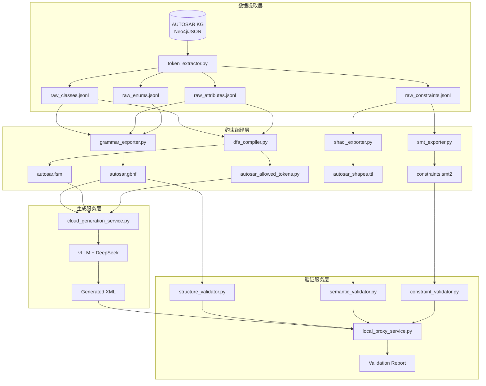

# AUTOSAR XML智能生成与验证系统完整设计文档

## 文档信息

| 项目名称 | AUTOSAR XML智能生成与验证系统 |
|----------|------------------------------|
| 版本 | v4.0 |
| 创建日期 | 2025-01-26 |
| 文档类型 | 完整系统设计文档 |
| 作者 | 系统架构团队 |

---

## 1. 系统概述

### 1.1 系统目标

构建基于vLLM + DeepSeek的AUTOSAR XML智能生成系统，通过"三段护栏"架构确保生成内容在结构、语义和约束三个层面都符合AUTOSAR规范。

### 1.2 核心设计理念

**"单源真相 + 扁平快照 + 约束前置 + 验证分层"**

- **单源真相**: KG作为唯一事实源，所有约束信息均来自知识图谱
- **扁平快照**: 通过raw_*.jsonl四表快照实现下游解耦
- **约束前置**: 生成时硬约束(FSM+GBNF) + 生成后验证(SHACL+SMT)
- **验证分层**: 结构→语义→深度约束的渐进式验证

### 1.3 三段护栏架构

```
生成阶段                           验证阶段
┌─────────────────────┐           ┌─────────────────────┐
│ 第一段: 结构护栏       │           │ 结构验证 (GBNF)      │
│ - FSM状态机约束       │  ──────>  │ - XML标签序列验证     │
│ - 标签嵌套顺序        │           │ - 词法合规性检查     │
├─────────────────────┤           ├─────────────────────┤
│ 第二段: 词法护栏       │           │ 语义验证 (SHACL)     │
│ - GBNF语法约束        │  ──────>  │ - 引用完整性验证     │
│ - 枚举值限制          │           │ - 基数约束检查       │
├─────────────────────┤           ├─────────────────────┤
│ 第三段: 混合约束       │           │ 深度验证 (SMT)       │
│ - 上下文相关映射      │  ──────>  │ - 跨实体关系验证     │
│ - 动态约束选择        │           │ - 数学约束求解       │
└─────────────────────┘           └─────────────────────┘
```

---

## 2. 系统架构

### 2.1 整体架构图



### 2.2 数据流转

| 阶段 | 输入 | 处理组件 | 输出 | 用途 |
|------|------|----------|------|------|
| **数据提取** | AUTOSAR KG | token_extractor.py | raw_*.jsonl | 扁平化KG数据 |
| **约束编译** | raw_*.jsonl | 各exporter | 约束产物 | 不同层次的约束文件 |
| **云端生成** | 约束产物 + 用户提示 | vLLM服务 | XML文本 | 约束化生成 |
| **本地验证** | XML文本 + 约束产物 | 验证器 | 验证报告 | 三段式验证 |

---

## 3. 核心模块设计

### 3.1 数据提取模块 (token_extractor.py)

#### 3.1.1 功能职责
- 从AUTOSAR KG中提取所有约束相关信息
- 生成四张扁平快照表
- 实现增量更新机制

#### 3.1.2 关键算法
```python
# 可序列化类发现算法
def discover_serializable_classes(root_class_ids):
    """BFS遍历composition/aggregation关系，发现所有XML可见类"""
    # 输入: 根类ID列表
    # 输出: 所有可序列化类的集合
    # 算法: 广度优先搜索，避免循环引用

# 属性聚合算法  
def aggregate_attributes(class_id):
    """聚合类的所有有效属性（自身+继承+inline）"""
    # 输入: 类ID
    # 输出: 去重后的属性列表
    # 处理: 继承链、inline展开、同名覆盖
```

#### 3.1.3 输出格式

**raw_classes.jsonl**
```json
{"classId": 1234, "className": "SwcInternalBehavior", "xml_tag": "SWC-INTERNAL-BEHAVIOR", "xml_wrapper_tag": null}
```

**raw_attributes.jsonl**
```json
{"classId": 1234, "attrId": 5678, "xml_tag": "EVENTS", "xml_wrapper_tag": null, "isXmlAttr": false, "minOccurs": 0, "maxOccurs": -1, "typeId": 9012, "attributeClass": true}
```

**raw_enums.jsonl**
```json
{"enumId": 3456, "values": ["QUEUED", "STANDARD", "IMMEDIATE"]}
```

**raw_constraints.jsonl**
```json
{"constraintId": 7890, "type": "range", "targets": ["TimingEvent.period"], "min": 1, "max": 1000, "expression": "Period must be between 1 and 1000 ms"}
```

### 3.2 约束编译模块

#### 3.2.1 GBNF语法生成器 (grammar_exporter.py)

**职责**: 生成词法层约束，处理TOKEN定义和小枚举

**关键函数**:
- `generate_token_definitions()`: 生成XML标签的TOKEN定义
- `generate_enum_rules()`: 生成≤64值的枚举规则
- `normalize_tag()`: 标签规范化处理

**输出示例**:
```gbnf
# TOKEN定义
SWC_INTERNAL_BEHAVIOR: "SWC-INTERNAL-BEHAVIOR"
TIMING_EVENT: "TIMING-EVENT"

# 枚举规则
<sw_impl_policy> ::= "QUEUED" | "STANDARD" | "IMMEDIATE"
<event_kind> ::= "INIT" | "EXIT" | "ENTRY"

# 根规则
start ::= <swc_internal_behavior> | <timing_event>
```

#### 3.2.2 DFA编译器 (dfa_compiler.py) - 重构重点

**职责**: 生成结构层约束，处理XML嵌套和顺序

**核心算法**:
```python
def build_dfa_from_raw_data():
    """从raw数据直接构建DFA，不依赖GBNF解析"""
    # 1. 预索引: tag2cid, children[cid] -> List[AttrRec]
    # 2. BFS遍历: (state_str, cid) -> transitions
    # 3. Wrapper处理: xml_wrapper_tag优先级
    # 4. 深度限制: MAX_DEPTH=10
    # 5. Hopcroft压缩: 减少状态数量
```

**关键创新**:
- **上下文相关映射**: 使用`parent_cid:xml_tag`复合键解决映射冲突
- **智能枚举分类**: 区分类型约束枚举(FSM处理)和值约束枚举(GBNF处理)
- **XML属性过滤**: 严格过滤`isXmlAttr=true`的属性

**输出格式**:
```json
{
  "version": 2,
  "states": ["", "swc_internal_behavior", "swc_internal_behavior events"],
  "edges": {
    "": {"swc_internal_behavior": "swc_internal_behavior"},
    "swc_internal_behavior": {"events": "swc_internal_behavior events"}
  },
  "accept": ["", "swc_internal_behavior", "swc_internal_behavior events"]
}
```

#### 3.2.3 allowed_tokens运行时生成器

**输出**: `autosar_allowed_tokens.py`
```python
def allowed(prefix: list[str]) -> set[str] | None:
    """查询当前前缀下允许的下一个token"""
    state = " ".join(prefix) if prefix else ""
    return TRANSITIONS.get(state)
```

#### 3.2.4 SHACL形状生成器 (shacl_exporter.py)

**职责**: 生成语义层约束，处理引用完整性和基数约束

**关键函数**:
- `generate_cardinality_shapes()`: 基数约束形状
- `generate_reference_shapes()`: 引用完整性形状  
- `generate_value_shapes()`: 值域约束形状

**输出示例**:
```turtle
@prefix sh: <http://www.w3.org/ns/shacl#> .
@prefix autosar: <http://autosar.org/schema#> .

autosar:TimingEventShape a sh:NodeShape ;
    sh:targetClass autosar:TimingEvent ;
    sh:property [
        sh:path autosar:period ;
        sh:minInclusive 1 ;
        sh:maxInclusive 1000 ;
        sh:datatype xsd:integer ;
    ] .
```

#### 3.2.5 SMT约束生成器 (smt_exporter.py)

**职责**: 生成深度约束，处理跨实体关系和数学约束

**关键特性**:
- **关系型约束**: 支持`{"if": A, "then": B}`的JSON DSL
- **跨类存在性**: 处理实体间的依赖关系
- **数学关系**: 时序约束、区间关系等

**输出示例**:
```smt2
(declare-sort Entity)
(declare-fun TimingEvent_period (Entity) Int)
(declare-fun TimingEvent_deadline (Entity) Int)

; 基本约束
(assert (forall ((e Entity))
  (and (>= (TimingEvent_period e) 1)
       (<= (TimingEvent_period e) 1000))))

; 关系约束  
(assert (forall ((e Entity))
  (< (TimingEvent_deadline e) (TimingEvent_period e))))

(check-sat)
```

### 3.3 云端生成服务模块

#### 3.3.1 约束引导生成器

**FSM约束引导器**:
```python
class FSMGuidedGenerator:
    def create_logits_processor(self):
        """创建基于FSM状态的logits处理器"""
        # 输入: token序列
        # 输出: 约束后的logits
        # 功能: 实时约束XML标签生成
```

**GBNF约束引导器**:
```python  
class GBNFGuidedGenerator:
    def create_guided_config(self):
        """创建GBNF引导配置"""
        # 输入: GBNF语法
        # 输出: vLLM引导配置
        # 功能: 词法层约束
```

**混合约束引导器**:
```python
class HybridGuidedGenerator:
    def create_sampling_params(self):
        """创建混合约束采样参数"""
        # 输入: 温度、最大token数
        # 输出: vLLM采样参数
        # 功能: FSM+GBNF混合约束
```

#### 3.3.2 云端服务架构

**核心服务类**:
```python
class AutosarCloudService:
    async def initialize(self):
        """异步初始化vLLM模型和约束"""
        
    async def generate_xml(self, request):
        """执行约束XML生成"""
        # 1. 提示增强
        # 2. 约束策略选择  
        # 3. vLLM生成
        # 4. 后处理
        
    def _enhance_prompt(self, request):
        """基于AUTOSAR上下文增强提示"""
        
    def _create_sampling_params(self, request):
        """创建约束采样参数"""
```

### 3.4 本地验证服务模块

#### 3.4.1 结构验证器 (structure_validator.py)

**职责**: 验证XML结构和词法合规性

**核心验证方法**:
```python
class StructureValidator:
    def validate_structure(self, xml_content):
        """验证XML结构是否符合GBNF语法"""
        # 输入: XML内容字符串
        # 输出: 验证结果字典
        # 算法: token序列提取 + 语法解析
        
    def extract_token_sequence(self, xml_content):
        """从XML提取token序列"""
        
    def get_error_location(self, xml_content, error_info):
        """定位语法错误位置"""
```

#### 3.4.2 语义验证器 (semantic_validator.py)

**职责**: SHACL语义约束验证

**核心验证方法**:
```python
class SemanticValidator:
    def validate_semantics(self, xml_content):
        """执行SHACL语义验证"""
        # 输入: XML内容字符串
        # 输出: 语义验证结果
        # 流程: XML->RDF转换 + SHACL验证
        
    def xml_to_rdf(self, xml_content):
        """将AUTOSAR XML转换为RDF图"""
        
    def extract_violations(self, results_graph):
        """提取SHACL违规信息"""
```

#### 3.4.3 约束验证器 (constraint_validator.py)

**职责**: SMT深度约束验证

**核心验证方法**:
```python
class ConstraintValidator:
    def validate_constraints(self, xml_content):
        """SMT约束验证"""
        # 输入: XML内容字符串
        # 输出: 约束验证结果
        # 流程: 数据提取 + SMT实例生成 + Z3求解
        
    def extract_constraint_data(self, xml_content):
        """从XML提取约束数据"""
        
    def generate_smt_instances(self, constraint_data):
        """生成SMT求解实例"""
        
    def solve_smt_instance(self, smt_instance):
        """调用Z3求解器验证"""
```

#### 3.4.4 验证编排器 (validation_orchestrator.py)

**职责**: 三段验证流程编排

**核心编排方法**:
```python
class ValidationOrchestrator:
    def execute_full_validation(self, xml_content, validation_level):
        """执行完整三段验证"""
        # 输入: XML内容, 验证级别
        # 输出: 完整验证结果
        # 流程: 结构->语义->约束的渐进验证
        
    def execute_incremental_validation(self, xml_content, failed_stage):
        """增量验证(从失败点继续)"""
        
    def generate_validation_report(self, validation_results):
        """生成人类可读验证报告"""
```

---

## 4. 部署架构

### 4.1 分离式部署设计

```
┌─────────────────┐    ┌─────────────────┐    ┌─────────────────┐
│   本地约束服务    │    │    云GPU服务     │    │    客户端应用    │
│ (Proxy Service) │◄───┤ (vLLM+DeepSeek) │◄───┤ (Frontend/API)  │
│                │    │                │    │                │
│ - 约束产物加载   │    │ - 模型推理       │    │ - 请求处理       │
│ - 三段验证       │    │ - 约束生成       │    │ - 结果展示       │
│ - 缓存管理       │    │ - HTTP API      │    │ - 用户界面       │
└─────────────────┘    └─────────────────┘    └─────────────────┘
```

### 4.2 云端服务配置

**模型配置**:
```python
@dataclass
class CloudVLLMConfig:
    model_name: str = "deepseek-ai/deepseek-coder-33b-instruct"
    max_model_len: int = 8192
    tensor_parallel_size: int = 1
    gpu_memory_utilization: float = 0.9
```

**约束配置**:
```python
@dataclass  
class ConstraintConfig:
    fsm_path: str = "/app/artifacts/autosar.fsm"
    gbnf_path: str = "/app/artifacts/autosar.gbnf" 
    max_enum: int = 64
    max_depth: int = 10
```

### 4.3 本地代理服务

**代理服务职责**:
- 缓存管理: 避免重复云端请求
- 验证编排: 执行三段式验证
- 错误处理: 提供详细错误信息
- 性能监控: 记录生成和验证性能

---

## 5. 关键技术创新

### 5.1 上下文相关映射解决方案

**问题**: 同一XML标签在不同上下文中指向不同类

**解决方案**: 
```python
# 传统映射(有冲突)
tag2cid = {"category": 3364}

# 上下文相关映射(无冲突)  
contextual_tag2cid = {
    "1234:category": 3364,  # 在父类1234下
    "5678:category": 3292,  # 在父类5678下
}

def resolve_child_cid(parent_cid, child_tag):
    """优先使用上下文映射"""
    context_key = f"{parent_cid}:{child_tag}"
    return contextual_tag2cid.get(context_key) or global_tag2cid.get(child_tag)
```

### 5.2 智能枚举分类算法

**问题**: 枚举值性质不同需要不同处理策略

**解决方案**:
```python
def classify_enum_values(values):
    if is_autosar_type_constraint(values):
        # 类型约束 -> FSM处理
        # 例: ["P-PORT-PROTOTYPE", "R-PORT-PROTOTYPE"]
        return "TYPE_CONSTRAINT"
    elif len(values) <= MAX_ENUM:
        # 小枚举 -> GBNF处理  
        # 例: ["QUEUED", "STANDARD"]
        return "VALUE_CONSTRAINT_SMALL"
    else:
        # 大枚举 -> SHACL处理
        return "VALUE_CONSTRAINT_LARGE"

def is_autosar_type_constraint(values):
    """判断是否为AUTOSAR类型约束"""
    type_pattern = re.compile(r'^[A-Z][A-Z0-9-]*[A-Z0-9]$')
    return all(type_pattern.match(v) for v in values)
```

### 5.3 增量编译机制

**问题**: KG更新时避免全量重编译

**解决方案**:
```python
def check_incremental_update():
    """基于文件哈希的增量更新检查"""
    current_hashes = compute_file_hashes(["raw_classes.jsonl", ...])
    cached_hashes = load_hash_index()
    
    changed_files = []
    for file, current_hash in current_hashes.items():
        if cached_hashes.get(file) != current_hash:
            changed_files.append(file)
    
    return changed_files

def selective_rebuild(changed_files):
    """根据变更文件选择性重构建"""
    if "raw_classes.jsonl" in changed_files:
        rebuild_fsm()
    if "raw_enums.jsonl" in changed_files:
        rebuild_gbnf()
    # ...
```

---

## 6. 性能指标与优化

### 6.1 性能目标

| 指标类型 | 目标值 | 说明 |
|----------|--------|------|
| **生成性能** |  |  |
| 生成延迟 | < 2秒 | 平均响应时间 |
| 生成吞吐 | > 100 QPS | 并发处理能力 |
| 约束命中率 | > 95% | 约束生效比例 |
| GPU利用率 | > 80% | 资源利用效率 |
| **验证性能** |  |  |
| 验证延迟 | < 500ms | 三段总计时间 |
| 结构验证 | < 100ms | GBNF解析时间 |
| 语义验证 | < 200ms | SHACL推理时间 |
| 约束验证 | < 200ms | SMT求解时间 |
| **系统指标** |  |  |
| 端到端延迟 | < 3秒 | 完整处理时间 |
| 生成准确率 | > 90% | 验证通过比例 |
| 系统可用性 | > 99.9% | 服务稳定性 |
| 缓存命中率 | > 60% | 缓存效率 |

### 6.2 性能优化策略

**编译期优化**:
- Hopcroft最小化: 减少DFA状态数量
- 路径压缩: 消除冗余转换
- 状态缓存: 避免重复计算

**运行期优化**:  
- Token掩码缓存: 缓存常用状态的token集合
- 批量处理: 支持请求批量化
- 懒加载: 按需加载约束文件

**内存优化**:
- 状态压缩: 使用紧凑的状态表示
- 增量加载: 分块加载大型约束文件
- 垃圾回收: 及时清理无用状态

---

## 7. 测试与质量保证

### 7.1 测试策略

| 测试层级 | 测试类型 | 覆盖范围 | 工具 |
|----------|----------|----------|------|
| **单元测试** | 功能测试 | 各模块核心函数 | pytest |
| **集成测试** | 接口测试 | 模块间交互 | pytest + mock |
| **系统测试** | 端到端测试 | 完整流程 | 自动化脚本 |
| **性能测试** | 压力测试 | 高并发场景 | locust |
| **验收测试** | 业务测试 | AUTOSAR场景 | 专家验证 |

### 7.2 测试用例设计

**约束生成测试**:
```python
def test_fsm_constraint_generation():
    """测试FSM约束生成的正确性"""
    assert_state_transitions_valid()
    assert_accepting_states_complete()
    assert_no_unreachable_states()

def test_enum_classification():
    """测试枚举分类算法"""
    type_enum = ["P-PORT-PROTOTYPE", "R-PORT-PROTOTYPE"]
    value_enum = ["QUEUED", "STANDARD"]
    assert classify_enum_values(type_enum) == "TYPE_CONSTRAINT"
    assert classify_enum_values(value_enum) == "VALUE_CONSTRAINT_SMALL"
```

**验证测试**:
```python
def test_validation_pipeline():
    """测试三段验证流程"""
    xml_content = generate_test_xml()
    results = execute_full_validation(xml_content)
    assert results["structure"]["valid"] == True
    assert results["semantic"]["valid"] == True
    assert results["constraint"]["valid"] == True
```

### 7.3 持续集成

**CI/CD流程**:
```yaml
# GitHub Actions示例
name: AUTOSAR System CI
on: [push, pull_request]
jobs:
  test:
    runs-on: ubuntu-latest
    steps:
      - uses: actions/checkout@v2
      - name: Setup Python
        uses: actions/setup-python@v2
      - name: Install dependencies
        run: pip install -r requirements.txt
      - name: Run unit tests
        run: pytest tests/unit/
      - name: Run integration tests
        run: pytest tests/integration/
      - name: Generate coverage report
        run: coverage report --show-missing
```

---

## 8. 扩展性与演进

### 8.1 架构扩展点

| 扩展方向 | 当前状态 | 扩展方案 | 优先级 |
|----------|----------|----------|--------|
| **约束类型** | 枚举+基数+引用 | 添加新exporter | 🔴高 |
| **模型后端** | vLLM+DeepSeek | 支持多模型 | 🟠中 |
| **验证引擎** | SHACL+SMT | 添加新验证器 | 🟠中 |
| **存储后端** | Neo4j+JSON | 支持其他KG | 🟡低 |

### 8.2 技术演进路线

**短期目标(1-3个月)**:
- 完善FSM状态机算法
- 优化约束生成性能  
- 增加更多约束类型支持

**中期目标(3-6个月)**:
- 支持多模型后端
- 实现智能约束选择
- 添加可视化调试工具

**长期目标(6-12个月)**:
- 基于强化学习的约束优化
- 支持增量式验证
- 构建约束知识库

### 8.3 可扩展性设计

**插件化架构**:
```python
# 约束生成器插件接口
class ConstraintGeneratorPlugin:
    def generate_constraints(self, kg_data):
        """生成特定类型的约束"""
        raise NotImplementedError
        
# 验证器插件接口  
class ValidatorPlugin:
    def validate(self, xml_content):
        """执行特定类型的验证"""
        raise NotImplementedError
```

**配置驱动**:
```yaml
# 系统配置文件
constraint_generators:
  - name: "fsm_generator"
    class: "FSMConstraintGenerator"
    config:
      max_depth: 10
      compress: true
      
validators:
  - name: "structure_validator"
    class: "GBNFStructureValidator"
    enabled: true
```

---

## 9. 运维与监控

### 9.1 监控指标

**系统监控**:
- CPU/内存/GPU使用率
- 网络I/O和延迟
- 磁盘空间和I/O

**业务监控**:
- 生成请求量和成功率
- 验证通过率和错误分布
- 用户满意度和使用模式

**性能监控**:
- 各阶段处理延迟
- 缓存命中率
- 约束生效率

### 9.2 日志与追踪

**日志分级**:
```python
# 日志配置示例
LOGGING_CONFIG = {
    "version": 1,
    "handlers": {
        "file": {
            "class": "logging.FileHandler",
            "filename": "autosar_system.log",
            "level": "INFO"
        },
        "console": {
            "class": "logging.StreamHandler", 
            "level": "DEBUG"
        }
    },
    "loggers": {
        "constraint_generation": {"level": "INFO"},
        "validation": {"level": "DEBUG"},
        "performance": {"level": "WARNING"}
    }
}
```

**分布式追踪**:
- 请求ID跟踪整个处理流程
- 每个阶段的开始和结束时间
- 错误和异常的详细上下文

### 9.3 故障处理

**故障分类**:
- 约束生成失败: 回退到宽松约束
- 模型服务故障: 自动重试和降级
- 验证服务故障: 跳过非关键验证

**恢复策略**:
- 服务重启和健康检查
- 数据备份和恢复
- 流量切换和容灾

---

## 10. 使用指南

### 10.1 快速开始

**环境准备**:
```bash
# 1. 克隆项目
git clone https://github.com/your-org/autosar-vllm-system.git
cd autosar-vllm-system

# 2. 安装依赖
pip install -r requirements.txt

# 3. 配置环境变量
export KG_URI="bolt://localhost:7687"
export CLOUD_ENDPOINT="https://your-gpu-service.com"
export ARTIFACTS_DIR="./artifacts"
```

**数据准备**:
```bash  
# 1. 从KG提取数据
python -m token_extractor dump --kg $KG_URI --out artifacts/raw

# 2. 编译约束文件
python -m cli build --raw artifacts/raw --out artifacts --roots roots.json
```

**服务启动**:
```bash
# 1. 启动云端vLLM服务
python cloud_vllm_server.py

# 2. 启动本地代理服务  
python local_proxy_service.py

# 3. 测试生成
curl -X POST http://localhost:8001/generate \
  -H "Content-Type: application/json" \
  -d '{"prompt": "Generate AUTOSAR timing event", "max_tokens": 1024}'
```

### 10.2 配置说明

**模型配置**:
```yaml
model:
  name: "deepseek-ai/deepseek-coder-33b-instruct"
  max_length: 8192
  temperature: 0.7
  
constraints:
  max_enum: 64
  max_depth: 10  
  compress: true
  
validation:
  enable_structure: true
  enable_semantic: true
  enable_constraint: true
```

**性能调优**:
```yaml
performance:
  batch_size: 16
  cache_size: 1000
  timeout: 30
  
monitoring:
  enable_metrics: true
  log_level: "INFO"
  trace_requests: true
```

### 10.3 常见问题

**Q: 生成的XML不符合AUTOSAR规范怎么办？**
A: 检查验证报告中的具体错误信息，根据结构/语义/约束错误类型进行相应调整。

**Q: 约束生成速度太慢怎么优化？**  
A: 可以调整MAX_DEPTH参数减少状态空间，或启用compress选项压缩状态机。

**Q: 如何添加新的约束类型？**
A: 实现新的exporter插件，并在配置文件中注册该插件。

---

## 11. 总结

### 11.1 核心价值

本系统通过"三段护栏"架构实现了：

1. **智能化生成**: 基于大语言模型的自然语言到AUTOSAR XML的转换
2. **多层次约束**: 结构+语义+深度约束的全覆盖保障  
3. **高性能部署**: 云端推理+本地验证的分离式架构
4. **可扩展设计**: 插件化和配置驱动的灵活扩展能力

### 11.2 技术创新

- **上下文相关映射**: 解决XML标签的多义性问题
- **智能枚举分类**: 自动选择最优的约束处理策略
- **增量编译**: 基于哈希的增量更新机制
- **混合约束策略**: FSM+GBNF+SHACL+SMT的协同工作

### 11.3 应用前景

该系统为AUTOSAR开发提供了全新的智能化工具链，显著提升了：
- 开发效率: 自动化XML配置生成
- 质量保证: 多层次约束验证
- 学习门槛: 自然语言交互界面
- 维护成本: 自动化验证和修复

通过持续的技术演进和功能扩展，该系统有望成为AUTOSAR开发的标准工具平台。

---

*本设计文档将随着系统的发展持续更新和完善。*