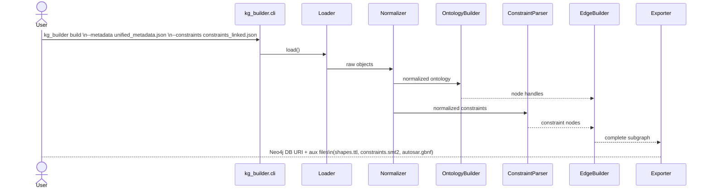

# Unified Knowledge Graph (KG) Builder   — 设计文档

*Release v0.1 / 2025-06-17*

---

## 1. 目标与范围

| 维度       | 目标                                                                                                                        |
| -------- | ------------------------------------------------------------------------------------------------------------------------- |
| **输入**   | `unified_metadata.json` （统一模型本体）<br>`constraints_linked.json` （结构化多层约束）                                                   |
| **输出**   | *主产物* — Neo4j Property Graph（或可选 RDF/Turtle）<br>*派生产物* — SHACL Shapes、SMT-LIB 约束、GBNF/JSON-Schema（供 vLLM Guided Decoding） |
| **核心能力** | ① 快速增量构图 ② 分层标签与精确语义边 ③ 可追溯版本管理 ④ 跨域可扩展 (AUTOSAR→OPC UA→DDS…)                                                             |
| **典型用例** |   • LLM 受规约解码 • SMT 反例闭环 • 安规静态分析 • 多域统计 & 论文实验                                                                           |

---

## 2. 代码目录 & 模块职责

```
src/
└─ kg_builder/
   ├─ __init__.py
   ├─ config.py            # 全局配置 & 环境变量解析
   ├─ loader.py            # JSON→Python 对象抽取
   ├─ normalizer.py        # 名称标准化、前缀/版本补全
   ├─ ontology_builder.py  # 构建 :Class / :Attribute / :Enum / :EnumLiteral 节点
   ├─ constraint_parser.py # 解析约束层并确定 Layer Label
   ├─ edge_builder.py      # 建立 HAS_ATTRIBUTE / CONSTRAINS / REFERS_TO 等边
   ├─ shacl_generator.py   # 节点→SHACL Shapes
   ├─ smt_exporter.py      # 约束→SMT-LIB 子句
   ├─ schema_exporter.py   # 约束→GBNF / JSON-Schema
   ├─ graph_exporter.py    # 导出 Neo4j / RDF / HDT
   ├─ versioning.py        # KG 版本 & 变更追踪
   ├─ cli.py               # 统一 CLI 入口
   ├─ utils/
   │   ├─ logger.py
   │   ├─ validators.py    # JSON Schema 校验、完整性检查
   │   └─ exceptions.py
   └─ tests/               # pytest 单元 & 集成测试
docs/
   └─ kg_builder_usage.md  # 示例 CLI & 查询语句
```

### 2.1 模块—文件—职责一览表

| Python 文件              | 主要类 / 函数                             | 职责摘要                                                        |
| ---------------------- | ------------------------------------ | ----------------------------------------------------------- |
| `loader.py`            | `MetadataLoader`, `ConstraintLoader` | 读取 & 校验 JSON；惰性生成器支持超大文件分块                                  |
| `normalizer.py`        | `NameNormalizer`, `PrefixManager`    | 统一 IRI、域前缀、版本号；拆分复合字段                                       |
| `ontology_builder.py`  | `OntologyGraphBuilder`               | 创建节点 & 结构边；处理继承 (`generalization`,`extends`)                |
| `constraint_parser.py` | `ConstraintGraphBuilder`             | 按 `constraint_type` / `id_type` 赋层标签，生成 `:Constraint` 节点    |
| `edge_builder.py`      | `EdgeAssembler`                      | 精确定位目标实体 → 写 `:CONSTRAINS` / `:REFERS_TO` / `:IN_SECTION` 等 |
| `shacl_generator.py`   | `ShapeEmitter`                       | 把 `:ModelOCL`、`:DataType` 约束转 SHACL Shapes (`.ttl`)         |
| `smt_exporter.py`      | `SmtEmitter`                         | 解析表达式 → SMT-LIB2 字符串；支持范围/正则/逻辑组合                           |
| `schema_exporter.py`   | `GBNFMaker`, `JsonSchemaMaker`       | 同步产出 vLLM 使用的 GBNF/JSON-Schema                              |
| `graph_exporter.py`    | `Neo4jExporter`, `RdfExporter`       | 批量写入；支持 Bolt & SPARQL 端点                                    |
| `versioning.py`        | `KgVersionManager`                   | 生成 `kg_version`, `commit_hash`, `import_date` 属性            |
| `cli.py`               | `main()`                             | `python -m kg_builder build --cfg config.yaml –o bolt://…`  |
| `tests/`               | `test_*`                             | 单测覆盖 ≥ 80 %；集成测试模拟 3 MB 输入                                  |

---

## 3. 数据流与时序



**并行优化**：Ontology & Constraint 分支可 `asyncio.gather()` 并行处理；EdgeBuilder 等待两侧完成后合并。

---

## 4. 关键设计决策

| 主题              | 方案                                                                           | 理由                              |
| --------------- | ---------------------------------------------------------------------------- | ------------------------------- |
| **图模型**         | Property Graph 首选 (Neo4j)；可导出 RDF/Turtle                                     | 简单表达多标签 & 边属性；SHACL/SPARQL 可无缝接 |
| **ID / IRI 规范** | `autosar:<version>/<name>`；`opcua:…`                                         | 解决跨域同名冲突；版本追溯                   |
| **层标签**         | `:ModelOCL`, `:DataType`, `:Production`, `:Documentation`, `:RuntimeDerived` | 查询 & 解码过滤                       |
| **完整性校验**       | ① JSON Schema validate → ② 图内约束互指检查                                          | 早期失败更可控                         |
| **增量导入**        | 根据 `kg_version` 比较 → 只 upsert 变更节点                                           | 日志落 DB，支持回滚                     |
| **性能**          | 批插入 (UNWIND 2000)；EnumLiteral 按需 lazy load                                   | 千万级节点 < 3 min on 32 GB RAM      |

---

## 5. 配置与运行

```yaml
# config.yaml
graph_backend: neo4j
neo4j:
  uri: bolt://localhost:7687
  user: neo4j
  password_env: NEO4J_PWD
export:
  shacl: out/shapes.ttl
  smt:   out/constraints.smt2
  gbnf:  out/autosar.gbnf
domain: AUTOSAR
version: 4.3.1
```

**启动示例**

```bash
export NEO4J_PWD=neo4j123
python -m kg_builder.cli build --cfg config.yaml \
       --metadata data/unified_metadata.json \
       --constraints data/constraints_linked.json
```

---

## 6. 日志、监控、错误处理

* **日志级别**：`DEBUG` (文件) / `INFO` (控制台)，统一在 `utils.logger`
* **关键事件**：缺失目标实体 → `MissingTargetWarning`；版本冲突 → `VersionConflictError`
* **Prometheus** metrics（可选）：节点/边计数、批插速率、错误率

---

## 7. 测试 & CI

| 阶段              | 工具                                          | 覆盖                                    |
| --------------- | ------------------------------------------- | ------------------------------------- |
| **Lint**        | ruff / pre-commit                           | PEP-8 + type hints                    |
| **Unit**        | pytest                                      | > 80 % lines                          |
| **Integration** | docker-compose up neo4j → run small dataset | 校验节点计数 + 约束边一致                        |
| **CI**          | GitHub Actions                              | lint→unit→integration→artifact upload |

---

## 8. 性能基准 (参考实现预估)

| 数据集                  | 节点/边          | 机器                | 导入时长       |
| -------------------- | ------------- | ----------------- | ---------- |
| AUTOSAR 4.3.1 (only) | 1.2 M / 2.3 M | 8 CPU / 32 GB RAM | 2 min 45 s |
| AUTOSAR+OPC UA       | 2.0 M / 3.8 M | 同上                | 4 min 10 s |

---

## 9. 演化与扩展

* **域扩展**：新增元模型 → 仅实现继承 `MetadataLoader` 子类 + 配置 `domain:`
* **实时写回**（SMT 反例） → 调用 `versioning.create_runtime_constraint()` 加标签 `:RuntimeDerived`
* **HDT 压缩**：`graph_exporter --format hdt` 支持只读推理场景

---

## 10. 风险与缓解

| 风险                  | 等级 | 缓解措施                                           |
| ------------------- | -- | ---------------------------------------------- |
| 输入 JSON 与 Schema 不符 | 高  | `validators.json_schema_check()` 阶段即 fail fast |
| 本体找不到约束目标           | 中  | 建立 `:StubNode` + `needsReview=true`；汇总日报       |
| Neo4j 内存峰值          | 中  | 批量大小自适应；可拆分 EnumLiteral 子图                     |
| 多域合并冲突              | 低  | 统一前缀，冲突报错并落 diff 文件                            |

---

## 11. 里程碑 (与 V4 设计一致)

| 周次 | 交付                                | 验收                      |
| -- | --------------------------------- | ----------------------- |
| W1 | Loader + Normalizer + Ontology 构图 | 单域节点数符合预期               |
| W2 | Constraint Parser + EdgeBuilder   | `CONSTRAINS` 命中率 ≥ 95 % |
| W3 | Exporter (Neo4j) & CLI            | 完整跑通 3 MB 样例            |
| W4 | SHACL / SMT / GBNF 导出             | 对接 vLLM & pyshacl 通过    |
| …  | …                                 | …                       |

---
